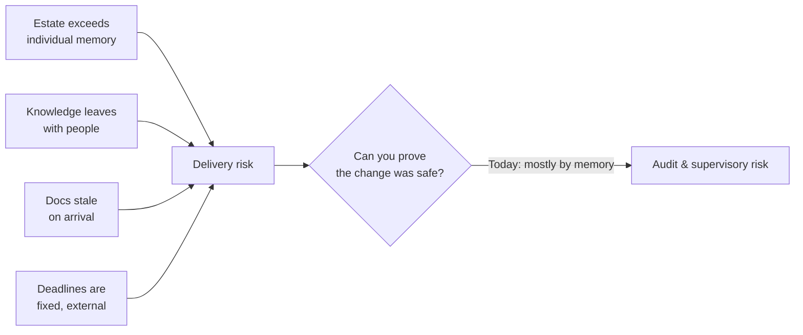
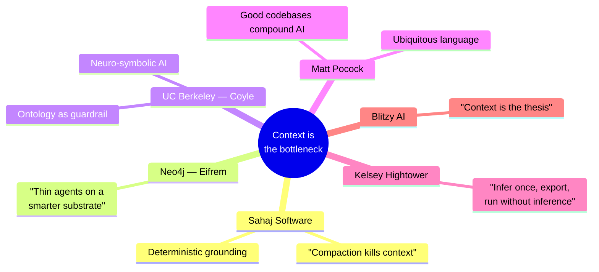
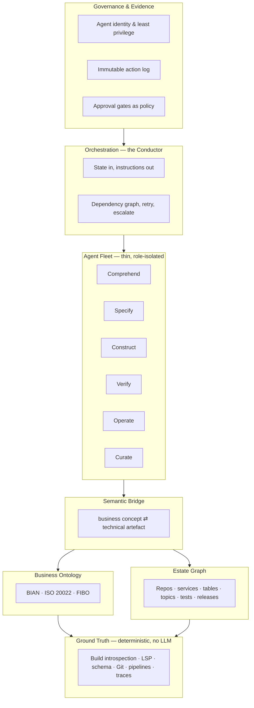
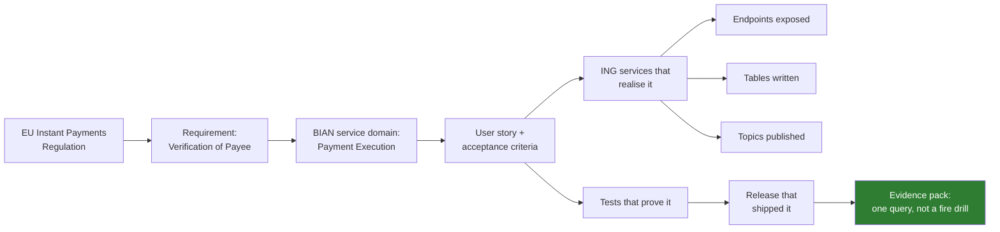
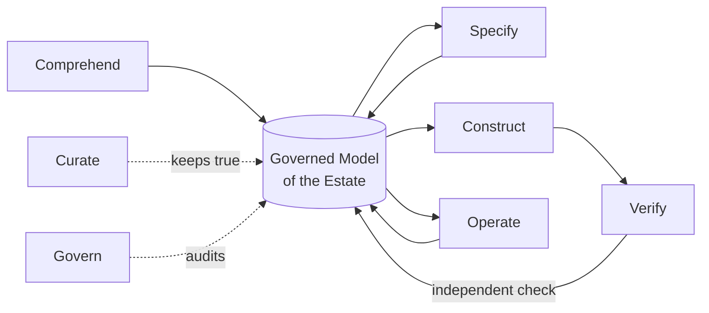
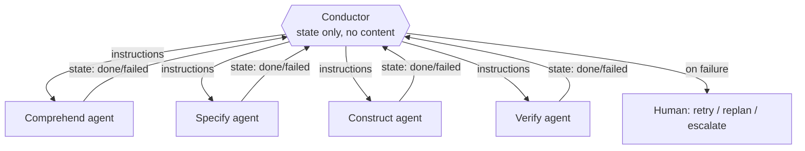
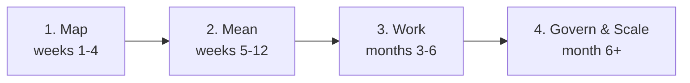

# PRIME.AI — Business Deck Content (v2)
### For ING Core Banking BTA Payments Leadership

> Working content file. Each `## Slide N` block is one slide: **Title** (the claim),
> **Body** (what appears on the slide — keep to this, do not add more when building the
> visual), **Diagram** (Mermaid, where applicable), and **Speaker notes** (the one sentence,
> the evidence tier, the hostile question, and what to concede — per
> `.github/skills/prime-exec-narrative/SKILL.md`). Evidence tiers per
> `.github/skills/prime-evidence-discipline/SKILL.md`: T1 independent, T2 vendor/practitioner,
> T3 our own measurement, T4 design intent.

---

## Slide 1 — Title

**Body:**
- PRIME.AI — Agentic Engineering for Core Banking Delivery
- Grounding AI agents in ING's model, not just in a language model
- BTA Payments Programme · HCLTech + ING Core Banking
- [Classification: Internal]

**Speaker note:** One sentence if nothing else lands: *"We ground the agents in the bank's
model, not just in the language model."*

---

## Slide 2 — Agenda

**Body:**
1. What we already proved — and what it doesn't yet answer
2. The one insight that changes the approach
3. PRIME.AI v2 — the architecture
4. Seeing it work — one payment, start to finish
5. What we measure, and what we don't claim
6. The path to adopt it

**Speaker note:** Signal early that this is a v2, not a rescue — invites less defensiveness
about v1's gaps.

---

## Slide 3 — The problem, in your terms

**Body:**
- The payments estate is bigger than anyone's memory — or any model's context window
- Knowledge leaves when people do
- Documentation is out of date the day it's written
- Regulatory deadlines do not move (IPR, ISO 20022, EPI/Wero)
- Every change must be provable — to your auditors, and to DNB
- **AI, pointed at a system nobody fully understands, produces confident answers fast — that is not a solution, it is a new risk**

**Diagram:**

**Speaker note:** Lead with risk, not speed — this audience buys delivery-risk reduction,
velocity is a consequence. T4 framing (no numbers yet).

---

## Slide 4 — What we already proved, stated honestly

**Body:**
- BTA Payments stream: 1 squad, 10 engineers, 7 agents, one full delivery cycle
- Endpoint delivery: 2 sprints → 1.4 sprints observed
- Capacity recovered was reinvested in the DG requirements, not banked as margin
- **What we did not yet measure:** defect escape rate, change-failure rate, rework/churn —
  the stability half of the picture
- Conclusion: the acceleration is real; the evidence pack around it is not yet complete

**Speaker note:** T3 claim, stated with what's missing rather than hiding it. Hostile Q:
*"How do you know quality didn't suffer?"* Honest answer: *"We don't have that evidence yet
— which is exactly what v2's measurement model is built to close."* This candour is the
single best trust move available in the whole deck.

---

## Slide 5 — The insight that changes the approach

**Body:**
- We looked outward — at how the best engineering organisations in the world are solving
  this same problem right now
- One conclusion, independently reached from six different directions:
  **the bottleneck was never the model. It's context.**
- An agent that doesn't understand the estate will fail confidently, however good the model is
- The fix isn't a bigger model or a longer prompt — it's giving agents a **structured,
  governed model of the estate to stand on**

**Diagram:**

**Speaker note:** T2, six named practitioner sources (full citations in appendix/dossier).
This slide earns the right to propose an architecture rather than another prompt library.

---

## Slide 6 — Our thesis, one sentence

**Body:**
> **We build and maintain one governed, living model of ING's payments estate —
> and run thin, specialised, accountable agents on top of it.**

- Not a bigger prompt library. Not a faster model. A **substrate**.
- Everything that follows is this sentence, unpacked.

**Speaker note:** Give the room ten seconds of silence on this slide. It is the whole pitch.

---

## Slide 7 — PRIME.AI, re-grounded

**Body:**
| | v1 (today) | v2 (proposed) |
|---|---|---|
| **P** | Prompt driven | **Progressive** disclosure — agents see only what their role needs |
| **R** | Reusable | **Role**-isolated — one agent, one competency, one narrow context |
| **I** | Intent focused | **Intent**-traceable — regulation → requirement → code → test → release, linked |
| **M** | Modular | **Model**-grounded — grounded in the bank's model, not just the language model |
| **E** | Engineering | **Evidenced** — every velocity claim carries a stability claim beside it |

- Same name. Same team's work carried forward. A firmer foundation underneath it.

**Speaker note:** Reframe as evolution, not indictment of v1 — protects the team that built
it while fixing the substance.

---

## Slide 8 — The architecture: seven planes

**Body:**
- Facts, then structure, then meaning, then work, then coordination, then accountability
- No language model ever touches raw estate data directly — it queries a governed model of it

**Diagram:**

**Speaker note:** This single diagram is the technical spine of the whole deck — everything
in the appendix zooms into one box here.

---

## Slide 9 — Layer 1: ground truth — never let a model do a parser's job

**Body:**
- Structure is already encoded in build files, language servers, database schemas, pipeline
  configs — extracting it is mechanical, not cognitive
- We use compilers, parsers and static analysis to build the map; language models are never
  spent re-deriving what a parser already knows
- **This is also the cost answer:** infer once, export the fact, query it forever — never
  pay inference twice for the same fact

**Speaker note:** T2 (Sahaj, Hightower). Direct pre-emption of the "isn't this expensive"
question — the honest answer is that most of the estate is mapped for free.

---

## Slide 10 — Layer 2: one model of the estate, speaking the bank's language

**Body:**
- Technical side: every repo, service, endpoint, table, topic, test, pipeline, release — as
  one connected graph, not 200 disconnected documents
- Business side: **we do not invent a payments ontology** — we ground it in the standards
  ING's architects already use:
  - **BIAN** — service domains and the banking service landscape
  - **ISO 20022** — the payments message model already mandated across SEPA, T2, CBPR+
  - **FIBO** — financial instruments and party concepts
- A `Customer` has a `first name`, never an `f_name` — the graph is legible to a business
  reader, not just a database

**Speaker note:** T1/T2 mixed — BIAN/ISO 20022/FIBO existence and mandate status is T1
(standards bodies, regulation); the design choice to adopt rather than invent is T4.
Hostile Q: *"Why not build our own?"* Answer: *"Because your engineers already speak this
language — adopting it is lower risk and lower cost than inventing one."*

---

## Slide 11 — Worked example: one payment, start to finish

**Body:**
- Follow a single change — a new validation rule for a SEPA Instant Credit Transfer —
  through the graph, not through seven disconnected tools

**Diagram:**

**Speaker note:** *"Ask any of your engineers today to produce this chain for a payment in
under a minute — that's the demo."* T4 (target-state capability) unless the demo has already
run this live, in which case promote to T3 and say so on the slide.

---

## Slide 12 — The agent fleet, reorganised around the work

**Body:**
- The seven agents you've already met don't disappear — they're regrouped by what the work
  needs, and two accountabilities are added that a generator-only fleet cannot provide

| Family | Does | New? |
|---|---|---|
| **Comprehend** | Understands the existing estate | **New** — the gap in v1 |
| **Specify** | Requirement → story → acceptance criteria | *(was: Story Generator)* |
| **Construct** | Writes the change | *(was: Code/Unit Test Generator)* |
| **Verify** | Independently checks the change | **New** — separated from Construct |
| **Operate** | Reproduces, triages, roots-causes, fixes | *(was: Defect Triage/Mechanic)* |
| **Curate** | Keeps the graph itself true and current | **New** — prevents drift |
| **Govern** | Assembles evidence, enforces policy | **New** — the audit answer |

**Diagram:**

**Speaker note:** T4 design. Hostile Q: *"Isn't Verify just Construct checking its own
work?"* Answer: *"No — different agent, different context, different inputs. A generator
cannot certify itself; that's the whole point of the split."*

---

## Slide 13 — Who watches the workers? Orchestration

**Body:**
- Every agent fleet needs an answer to three questions: how many workers run, what happens
  when one fails, what runs in parallel versus what must wait
- Our orchestrator — **the Conductor** — holds only pipeline state, never code or documents
- State flows in, instructions flow out; failure is a designed state: retry, replan, or
  escalate to a named human with context preserved

**Diagram:**

**Speaker note:** T2 (Sahaj's Conductor pattern, adopted). This is the direct answer to
"what happens when an agent gets it wrong at 2am" — nothing runs unsupervised past a
failure state.

---

## Slide 14 — Where AI is not allowed to touch

**Body:**
| Task | Deterministic tool | AI agent |
|---|---|---|
| Parse code, build call graph | ✅ | — |
| Dependency & impact analysis | ✅ | — |
| Schema/contract diff | ✅ | — |
| Lint, static analysis, security scan | ✅ | — |
| Test execution & coverage measurement | ✅ | — |
| Infer meaning of legacy code | — | ✅ |
| Draft requirement / story | — | ✅ |
| Propose the code change | — | ✅ |
| Root-cause a defect narrative | — | ✅ |

**Rule:** *if a compiler, parser or query could answer it, a language model is not asked to.*

**Speaker note:** T4 design rule, directly sourced from Sahaj/Hightower's split. This table
is the single strongest credibility slide in the deck — publishing where we *don't* use AI
is what makes the rest believable.

---

## Slide 15 — Guardrails: keeping probabilistic agents honest

**Body:**
- The graph isn't only retrieval — it's a **validator**. Constraints in the model catch
  what a plausible-sounding sentence would not:
  - A second refund against the same payment
  - A payout routed to a support agent instead of the beneficiary
  - An invented status such as "probably settled"
- Nothing reaches a human approval gate until it passes this check

**Speaker note:** T2 (Coyle's neuro-symbolic argument). Frame as "belt and braces", not as
"the AI checks itself" — the ontology is a separate, symbolic check, not the same model
marking its own work.

---

## Slide 16 — Governance is not overhead — it's the same graph

**Body:**
- Every agent is a named principal with least-privilege access — never a shared account
- Every proposal, approval and change is an entry in an immutable log
- A human approves every change that reaches production — the agent proposes, a person owns
- **The audit evidence pack and the engineering traceability graph are the same artefact** —
  produced once, used twice

**Speaker note:** T4. This slide exists because the current deck has none like it — for this
audience that omission is louder than anything we could add elsewhere.

---

## Slide 17 — How we'll measure it — and what we won't hide

**Body:**
- Every velocity metric is reported beside its stability partner — never alone

| Velocity | Paired with |
|---|---|
| Lead time for change | Change failure rate |
| Defect detection in-sprint | Defect escape rate |
| First-time-right rate | Code churn within 21 days |

- Independent research (METR, 2025–26) found developers can be measurably slower with AI
  on unfamiliar, high-standards codebases — while *believing* they were faster
- That finding describes exactly the conditions of core banking payments work — which is
  why we measure, rather than ask engineers how it felt

**Speaker note:** T1 for METR; T4 for our measurement commitment. This is the "we read the
inconvenient study and it changed our design" slide — the single best piece of credibility
in the deck, and it should never be cut for time.

---

## Slide 18 — Roadmap: four steps, each valuable alone

**Body:**
| Step | Delivers | Risk |
|---|---|---|
| **1. Map** | A queryable map of the payments stream — deterministic only | No AI risk at all |
| **2. Mean** | Business ontology grounded in BIAN/ISO 20022 | Standards adoption, not invention |
| **3. Work** | Existing agents re-grounded + Verify/Curate added | Same agents, evidenced improvement |
| **4. Govern & scale** | Evidence packs on demand; extend beyond payments | Becomes a reusable asset |

**Diagram:**

**Speaker note:** T4. Lead with step 1's lack of AI risk — it is the easiest yes a bank has
ever been asked to give, and it produces the artefact that makes every later step cheaper.

---

## Slide 19 — What we are not claiming

**Body:**
- Not claiming agents write production payment logic unsupervised — a human approves every change
- Not claiming a percentage of code is "AI-written" — that framing invites a question we
  can't comfortably answer
- Not claiming the ontology is complete on day one — it covers payments and grows by use
- Not claiming every engineer gets faster — independent evidence says otherwise for
  unfamiliar codebases, which is precisely the condition this architecture targets

**Speaker note:** Read this slide slowly. It is the slide that makes every other slide
believable.

---

## Slide 20 — The ask

**Body:**
- Approve Step 1 (Map) for the BTA Payments stream — four weeks, deterministic tooling only
- Agree the measurement baseline together, before we run it — not after
- Nominate an estate owner on ING's side to hold the model once it exists

**Speaker note:** Close on a small, low-risk, concrete yes — not a transformation commitment.

---
---

# Appendix (held in reserve, not presented unless asked)

## A1 — Full agent roster (mapping old → new)

| Old agent (v1) | New family | Reads from graph | Writes to graph |
|---|---|---|---|
| User Story Generation | Specify | Business ontology, precedent stories | Requirements, stories, traceability edges |
| Test Case Generation | Specify/Verify | Stories, acceptance criteria | Test cases, coverage edges |
| Code Generation | Construct | Impact slice, standards, precedent | Proposed change linked to story |
| Unit Test Case Generation | Construct/Verify | Code under change | Test evidence |
| INGenious Test Script Generator | Verify | Test cases, workflows | Automation evidence |
| Defect Triage | Operate | Defects, test results | Defect→code linkage |
| Mechanic | Operate | Runtime logs, traces | RCA, fix, release linkage |
| *(none)* | **Comprehend** | Ground truth, estate graph | Structure, boundaries, domain model |
| *(none)* | **Curate** | Whole graph | Freshness, drift flags, corrections |
| *(none)* | **Govern** | Action log, traceability | Evidence packs, control attestations |

## A2 — Competitive position (one paragraph)

Sahaj Software's public methodology is the strongest comprehension-only approach we found —
five layers, eleven agents, a lean orchestrator, and four disciplined context-engineering
principles, applied to reverse-engineering a legacy Java estate into documentation. It stops
at documents. PRIME.AI v2 adopts the same discipline but (a) turns the output into a
queryable, living graph rather than a documentation set, (b) grounds the business layer in
banking standards (BIAN/ISO 20022/FIBO) rather than a generic code taxonomy, (c) spans the
full lifecycle forward from requirement to release, not just comprehension, and (d) adds the
governance plane a regulated bank requires. No public competitor combines all four.

## A3 — Assumptions to validate with ING (do not present as fact)

1. Which graph technology is permitted in ING's approved estate
2. Where source-code-derived artefacts may be processed and stored, and under which model-hosting arrangement
3. Whether ING already holds a BIAN- or ISO-20022-aligned service catalogue to adopt rather than derive
4. The actual baseline behind the existing 30% figure — which sprints, which definition of done
5. Who owns the substrate after the engagement ends
6. What controls already apply to non-human actors in the pipeline today

## A4 — Glossary (one line each)

- **BIAN** — Banking Industry Architecture Network; a standard service-domain landscape for banks
- **ISO 20022** — the payments message standard behind SEPA, T2, CBPR+
- **FIBO** — Financial Industry Business Ontology (EDM Council)
- **Knowledge graph** — a queryable network of entities and relationships, not a document set
- **Ontology** — a formal, shared definition of the concepts and relationships in a domain
- **Orchestrator / Conductor** — the component that schedules agents and holds pipeline state only
