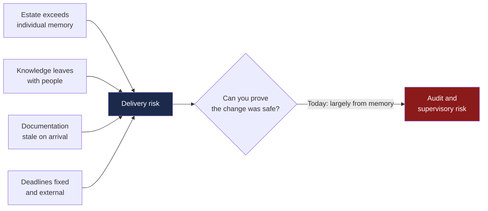
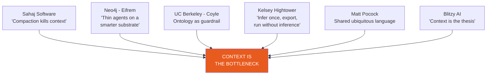
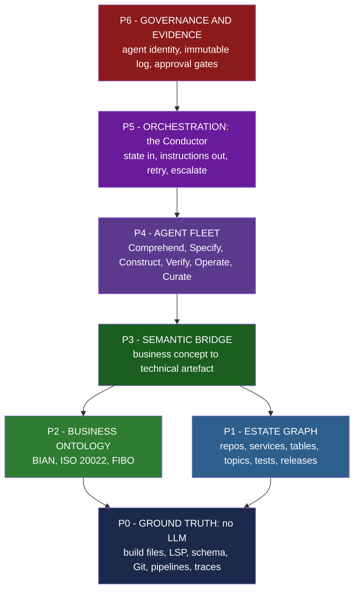
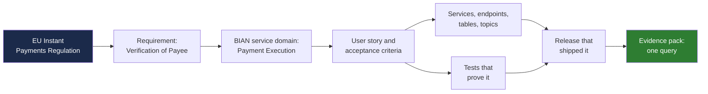
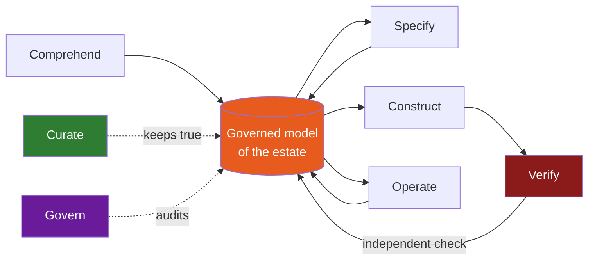
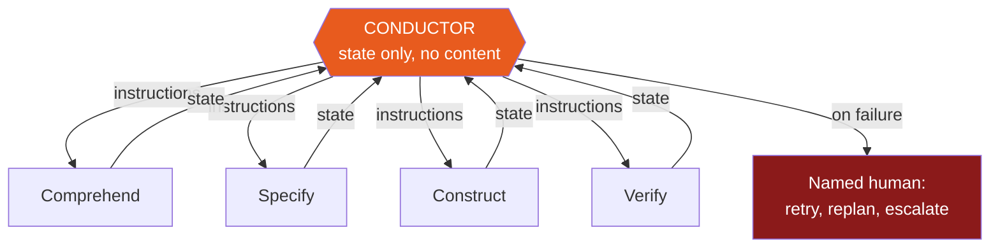
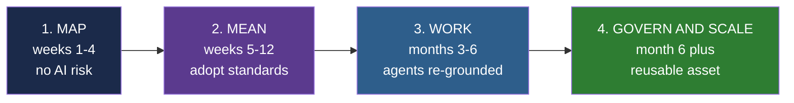

# PRIME.AI v2 — Complete Slide Contents
### Business pitch to ING Bank leadership · Core Banking / BTA Payments

**How to use this file.** Each slide block gives you: the **title** (written as a claim, not a
topic), the **exact on-slide text** (don't add more — the density is deliberate), a **visual
instruction**, a **Mermaid diagram** where one applies, and **speaker notes** containing the
one sentence that matters, the evidence tier, the likely hostile question, and what to concede.

**Evidence tiers used in the notes:**
`T1` independent (peer-reviewed, RCT, regulator, standards body) · `T2` credible but interested
(vendor / practitioner) · `T3` our own measurement from BTA Payments · `T4` design intent
(never phrase as achievement).

**Deck shape:** 20 main slides + 5 appendix. Runs 25–30 min with questions.
**Slides 6, 14, 17 and 19 are the four that win the room — never cut them for time.**

**Mermaid compatibility:** all diagrams use `flowchart` only (no `mindmap`, no `timeline`),
every label is quoted, no unicode arrows inside labels. All eight have been rendered and
validated with mermaid-cli v11. Paste into mermaid.live, Mermaid Chart, or the Mermaid
PowerPoint plugin. Pre-rendered PNG/SVG copies are in `research/diagrams/`.

---
---

# ACT 1 — THE PROBLEM (slides 1–4)

---

## Slide 1 — Title

**Title:** PRIME.AI

**On-slide text:**
```
PRIME.AI
Agentic Engineering for Core Banking Delivery

Grounding AI agents in ING's model of its business —
not just in a language model

BTA Payments Programme  ·  HCLTech + ING Core Banking
Classification: Internal
```

**Visual:** Full-bleed dark navy. Orange rule under the title. No stock imagery, no robots, no
brains-made-of-circuitry. The restraint is the message.

**Speaker notes:**
- **The one sentence:** *"We ground the agents in the bank's model, not just in the language model."*
- Say the subtitle out loud. It is the entire differentiator and it is worth 10 seconds of silence.
- Tier: `T4` framing only, no claims yet.

---

## Slide 2 — Agenda

**Title:** Where we're going

**On-slide text:**
```
1.  What we already proved — and what it doesn't yet answer
2.  The one insight that changed our approach
3.  PRIME.AI v2 — the architecture
4.  One payment, start to finish
5.  What we measure — and what we don't claim
6.  The path to adopt it
```

**Visual:** Numbered orange chips down the left, text right. Keep the same visual grammar as
the original deck's agenda so it reads as continuity, not replacement.

**Speaker notes:**
- Flag early that this is **v2 of your own methodology**, not a rescue. Lowers defensiveness,
  and it happens to be true.
- If asked "what changed?" up front: *"We checked our approach against how the best engineering
  organisations in the world are solving this. One answer came back, six times."*

---

## Slide 3 — The problem, in your terms

**Title:** The problem isn't speed. It's that nobody can see the whole estate.

**On-slide text:**
```
· The payments estate is bigger than any person's memory — or any model's context window
· Knowledge leaves the building when people do
· Documentation is out of date the day it is written
· Regulatory deadlines do not move
· Every change must be provable — to internal audit, and to DNB

AI pointed at a system nobody fully understands produces confident
answers quickly. That is not a solution. It is a new risk.
```

**Visual:** Five short lines, then the red callout box across the bottom third. The callout is
the slide; the bullets are set-up.

**Mermaid:**


**Speaker notes:**
- **The one sentence:** *"You're not buying speed. You're buying the ability to prove a change is safe, at speed."*
- Lead with risk. This audience is personally accountable to a supervisor; velocity is a
  consequence, not a purchase.
- **Hostile Q:** *"Every vendor tells us our estate is a mess."* **A:** *"I'm not saying it's a
  mess. I'm saying it's larger than any individual's working memory — that's a property of
  scale, not of quality. Which is why the answer has to be a model, not more people."*
- Tier: `T4`. No numbers on this slide, by design.

---

## Slide 4 — What we already proved, stated honestly

**Title:** We ran this for real. Here's what we can prove — and what we can't.

**On-slide text:**
```
WHAT WE OBSERVED — BTA Payments stream
· 1 squad · 10 engineers · 7 agents · one full delivery cycle
· Endpoint delivery: 2 sprints  ->  1.4 sprints
· Recovered capacity was reinvested in the DG requirements — not banked as margin

WHAT WE DID NOT MEASURE
· Defect escape rate   · Change failure rate   · Rework and churn
  — the stability half of the picture

The acceleration is real. The evidence pack around it is not yet complete.
```

**Visual:** Two equal-width columns — green-tinted "observed" left, red-tinted "not measured"
right. **Equal width is the point:** it signals we aren't hiding the second column.

**Speaker notes:**
- **The one sentence:** *"We'd rather show you the gap in our own evidence than have you find it."*
- Tier: `T3` for the sprint figures — **and you must be able to state the baseline**: which
  sprints, which stories, which definition of done. If you can't, soften to *"observed on
  endpoint delivery in this stream"* and say the baseline is being reconstructed.
- **Hostile Q:** *"So did quality suffer?"* **A:** *"We don't have the data to answer that, and
  I won't guess. Closing that gap is the first thing v2 does."*
- **What to concede:** everything about v1's measurement rigour. Concede it early, cheaply and
  completely — it buys credibility for every later number.
- ⚠️ **Never say "80% AI-assisted"** anywhere in this deck. In a payments context that reads as
  *"80% of our payment logic is machine-written"* and it's a risk-committee trigger.

---
---

# ACT 2 — THE INSIGHT (slides 5–7)

---

## Slide 5 — The insight that changed our approach

**Title:** We checked our approach against the field. One answer came back six times.

**On-slide text:**
```
The bottleneck was never the model. It is context.

An agent that does not understand the estate will fail — confidently —
no matter how good the model is.

The fix is not a bigger model or a longer prompt.
It is giving agents a structured, governed model of the estate to stand on.
```

**Visual:** Six source cards around a central orange node. Each card: name + one quote, nothing
more.

**Mermaid:**


**Speaker notes:**
- **The one sentence:** *"Six people solving this problem independently, from six different
  directions — and not one of them said 'use a better model'."*
- Tier: `T2` — named practitioners at public conferences. Cite the talks, not vendor brochures.
- This slide earns the right to propose an **architecture** rather than another prompt library.
  Without it slide 8 looks like invention; with it, slide 8 looks like convergence.
- **Hostile Q:** *"Isn't Neo4j's CEO just selling graphs?"* **A:** *"Yes — and I've marked his as
  a vendor source. The reason I trust the conclusion is that a Berkeley academic, a platform
  engineer who's openly sceptical of AI, and two consultancies with no graph product to sell
  reached the same place."* (That answer is precisely why the Hightower source is in the deck.)

---

## Slide 6 — The thesis ★ ONE OF THE FOUR THAT WIN THE ROOM

**Title:** *(no title — the sentence is the slide)*

**On-slide text:**
```
We build and maintain one governed, living model
of ING's payments estate —

and run thin, specialised, accountable agents on top of it.

Not a bigger prompt library. Not a faster model. A substrate.
```

**Visual:** Full-bleed navy, centred white text, nothing else. No bullets, no diagram, no logo
except in the corner. The only slide in the deck with one idea and zero supporting detail.

**Speaker notes:**
- Land it and **stop talking**. Count to five. Let them read it.
- If they remember one slide, this is it. Everything before is set-up; everything after is
  elaboration.
- Tier: `T4` — this is the proposal, stated as a proposal.

---

## Slide 7 — PRIME.AI, re-grounded

**Title:** The name stays. Every letter now names a principle we can be held to.

**On-slide text:**

| | v1 (today) | v2 (proposed) |
|---|---|---|
| **P** | Prompt driven | **Progressive** — agents see only what their role requires |
| **R** | Reusable | **Role-isolated** — one agent, one competency, one narrow context |
| **I** | Intent focused | **Intent-traceable** — regulation to requirement to code to test to release |
| **M** | Modular | **Model-grounded** — grounded in the bank's model, not just the language model |
| **E** | Engineering | **Evidenced** — every velocity claim carries a stability claim beside it |

```
Same name. The same team's work, carried forward. A firmer foundation underneath it.
```

**Visual:** Three-column table. Grey the v1 column slightly — present, respected, superseded.

**Speaker notes:**
- **The one sentence:** *"Version 1 was about how we configure agents. Version 2 is about what
  the agents stand on — and that's what decides whether this works on ten repositories or on
  the whole estate."*
- Framing as evolution protects the team who built v1 and avoids an internal political fight
  leaking into the client meeting.
- **P** and **R** are borrowed, with attribution, from Sahaj's published context-engineering
  principles. **I**, **M** and **E** are ours.

---
---

# ACT 3 — THE ARCHITECTURE (slides 8–16)

---

## Slide 8 — The architecture

**Title:** Seven planes: facts, then structure, then meaning, then work, then accountability

**On-slide text:**
```
No language model ever touches the raw estate.
It queries a governed model of it.
```

**Visual:** Seven stacked horizontal bands, darkest at the bottom. Read bottom-up. This is the
diagram every other slide zooms into — number it and refer back.

**Mermaid:**


**Speaker notes:**
- **The one sentence:** *"Read it bottom-up: we establish facts before structure, structure
  before meaning, and meaning before we let an agent do any work."*
- Don't explain all seven. Explain **P0, P2 and P6** — the three no competitor has shown them —
  and offer the rest on request.
- Tier: `T4` architecture.

---

## Slide 9 — P0: never let a model do a parser's job

**Title:** We don't pay a language model to learn what a compiler already knows

**On-slide text:**
```
· Structure is already encoded — in build files, language servers,
  database schemas, pipeline configuration
· Extracting it is mechanical, not cognitive.
  Compilers and parsers build the map; models are never spent re-deriving it

Infer once. Export the fact. Query it forever.
Never pay inference twice for the same fact.
```

**Visual:** Split panel — left, a dense list of "what a parser gives you for free"; right, a
much shorter list of "what only a model can do". **The asymmetry is the argument.**

**Speaker notes:**
- **The one sentence:** *"Most of your estate can be mapped without a single token of AI spend."*
- Tier: `T2` — Sahaj's "deterministic grounding" and Hightower's "infer once, export, run
  without inference".
- This is a **cost** slide disguised as an architecture slide. It pre-empts *"what will this
  cost in tokens?"* before it's asked.
- **Hostile Q:** *"So how much of this is actually AI?"* **A:** *"Less than you'd expect, and
  that's deliberate. AI is expensive and non-deterministic. We use it only where meaning is
  genuinely required."*

---

## Slide 10 — P1 + P2: one model, in the bank's language

**Title:** We don't invent an ontology. We adopt the one your architects already use.

**On-slide text:**
```
TECHNICAL SIDE — the estate graph
Every repo, service, endpoint, table, topic, test, pipeline, release —
one connected graph. Not 200 disconnected documents.

BUSINESS SIDE — grounded in banking standards, not invented
· BIAN       — the industry service-domain landscape (v12 includes Payments)
· ISO 20022  — the payments message model already mandated across SEPA, T2, CBPR+
· FIBO       — financial instrument and party concepts

A Customer has a first name — never an f_name.
Legible to a business reader, not just to a database.
```

**Visual:** Two panels joined by a bridge motif. Show the three standards as wordmarks — ING's
architects recognise them, and recognition does the persuading.

**Speaker notes:**
- **The one sentence:** *"The riskiest-sounding part of this proposal — 'we'll build an
  ontology' — is actually the safest, because we're not building one. We're adopting the
  industry's."*
- Tier: `T1` for the existence and mandated status of ISO 20022 and BIAN; `T4` for our design
  choice to adopt them.
- **Hostile Q — the most likely serious objection in the meeting, rehearse it:**
  *"We tried an enterprise data model once. It took three years and died."*
  **A:** *"That's the standard outcome for top-down modelling, and it's why we don't start
  there. We start with what parsers can extract in four weeks, and we add business meaning only
  where a delivery question needs it. The ontology grows by use, not by committee."*

---

## Slide 11 — One payment, start to finish

**Title:** Ask your team to produce this chain for one payment. Time them.

**On-slide text:**
```
A single change — a new validation rule on a SEPA Instant Credit Transfer —
followed through one model, instead of seven disconnected tools.
```

**Visual:** A single horizontal chain across the slide, last node in green. **This is the demo
slide** — if the demo works, run it live here instead of showing the diagram.

**Mermaid:**


**Speaker notes:**
- **The one sentence:** *"This chain exists in your organisation today — in people's heads, in
  six tools, and in a spreadsheet somebody maintains by hand. We're proposing to make it a query."*
- Tier: `T4` unless you've demoed it live — then say so explicitly and promote to `T3`.
- This slide does triple duty: the engineer sees impact analysis, the delivery lead sees
  progress tracking, the auditor sees evidence. **Say all three out loud** — different people
  in the room are buying different things.

---

## Slide 12 — The agent fleet

**Title:** Your seven agents don't disappear. They gain a supervisor and a librarian.

**On-slide text:**

| Family | What it does | Status |
|---|---|---|
| **Comprehend** | Understands the existing estate | **New** — the gap in v1 |
| **Specify** | Requirement to story to acceptance criteria | was Story Generator |
| **Construct** | Writes the change | was Code / Unit Test Generator |
| **Verify** | **Independently** checks the change | **New** — split from Construct |
| **Operate** | Reproduces, triages, root-causes, fixes | was Defect Triage / Mechanic |
| **Curate** | Keeps the graph itself true and current | **New** — prevents drift |
| **Govern** | Assembles evidence, enforces policy | **New** — the audit answer |

**Visual:** Table with the three "New" rows in a contrasting colour; old agent names in grey.
Continuity matters politically.

**Mermaid:**


**Speaker notes:**
- **The one sentence:** *"A fleet of seven generators with nothing checking them isn't an
  engineering system. It's a very fast way to produce work someone else has to review."*
- **Hostile Q:** *"Isn't Verify just the same AI marking its own homework?"* **A:** *"No.
  Different agent, different context, different inputs — and it reads the graph, not the
  generator's reasoning. A generator can't certify itself; that's exactly why we split it."*
- **Curate** is the quiet hero: without it this is Sahaj's documentation set with extra steps,
  and it goes stale just as fast.

---

## Slide 13 — Orchestration

**Title:** Who watches the workers?

**On-slide text:**
```
Every agent fleet must answer three questions:
  · How many workers run?
  · What happens when one fails?
  · What runs in parallel, and what must wait?

Our orchestrator — the Conductor — holds pipeline state only.
Never code. Never documents. It cannot be poisoned by what it coordinates.

Failure is a designed state: retry, replan, or escalate to a named human
with context preserved.
```

**Visual:** Hub and spoke. Conductor in orange at the centre, agents below, human escalation
path in red going up and out.

**Mermaid:**


**Speaker notes:**
- **The one sentence:** *"Nothing runs unsupervised past a failure. The orchestrator's job is to
  know what failed and stop — not to improvise."*
- Tier: `T2` — the Conductor pattern is adopted from Sahaj's published architecture, with
  attribution.
- **Hostile Q:** *"What happens if an agent goes wrong at 2am?"* **A:** *"It stops and escalates
  to a named person with full context of what it was doing. It doesn't retry blindly and it
  doesn't proceed."*

---

## Slide 14 — Where AI is not allowed to touch ★ ONE OF THE FOUR THAT WIN THE ROOM

**Title:** The most important thing we can tell you is where we *don't* use AI

**On-slide text:**

| Task | Deterministic tool | AI agent |
|---|---|---|
| Parse code, build call graph | ✅ | — |
| Dependency and impact analysis | ✅ | — |
| Schema and contract diff | ✅ | — |
| Lint, static analysis, security scan | ✅ | — |
| Test execution and coverage measurement | ✅ | — |
| Infer meaning of legacy code | — | ✅ |
| Draft requirement or user story | — | ✅ |
| Propose the code change | — | ✅ |
| Root-cause a defect narrative | — | ✅ |

```
The rule: if a compiler, parser or query could answer it,
a language model is not asked to.
```

**Visual:** Clean two-column tick table. Deterministic ticks deliberately outnumber AI ticks.
Rule statement in a navy band across the bottom.

**Speaker notes:**
- **The one sentence:** *"Everyone here has been pitched where AI can be used. I want to show
  you where we've decided it can't be."*
- This one table answers three objections at once — **cost** (fewer tokens), **accuracy**
  (deterministic where it matters), **auditability** (reproducible evidence).
- Tier: `T4` design rule, sourced from Sahaj and Hightower.
- **What to concede:** if someone argues a row belongs on the other side, agree to revisit it.
  The rule matters more than any individual row.

---

## Slide 15 — Guardrails

**Title:** The model isn't only how agents retrieve. It's how we catch them.

**On-slide text:**
```
The graph is also a validator. Constraints catch what a plausible-sounding
sentence would not:

  ·  A second refund raised against the same payment
  ·  A payout routed to a support agent instead of the beneficiary
  ·  An invented status — "probably settled"

Nothing reaches a human approval gate until it has passed this check.
```

**Visual:** Three red "caught" cards in a row. Payments examples only — generic examples waste
the slide.

**Speaker notes:**
- **The one sentence:** *"A language model will produce a fluent sentence about a second refund.
  A constraint in the model simply refuses it."*
- Tier: `T2` — Coyle's neuro-symbolic argument.
- Frame as **belt and braces**: a separate symbolic check, not the same model marking its own
  work. Blur that and you lose the slide.

---

## Slide 16 — Governance

**Title:** The audit pack and the engineering graph are the same artefact

**On-slide text:**
```
· Every agent is a named principal with least-privilege access — never a shared account
· Every proposal, approval and change is an entry in an immutable log
· A human approves every change that reaches production
  — the agent proposes, a person owns

Produced once. Used twice.
Governance stops being a tax on delivery and becomes a by-product of it.
```

**Visual:** One graph, two output arrows — "engineering" and "audit evidence" — pointing at two
different reader icons.

**Speaker notes:**
- **The one sentence:** *"Right now, producing audit evidence is a fire drill. We're proposing
  it become a query."*
- This slide exists **because the current deck has nothing like it**. For this audience, that
  omission was louder than anything else we could have added.
- **Hostile Q (CRO or Head of Compliance):** *"Who is accountable when an agent introduces a
  defect into production?"* **A:** *"The named human who approved the change — exactly as today.
  The agent has no approval authority. What changes is that the reviewer has better information
  than they do now, and the whole chain is logged."*

---
---

# ACT 4 — THE HONEST PART (slides 17–20)

---

## Slide 17 — Measurement ★ ONE OF THE FOUR THAT WIN THE ROOM

**Title:** Every speed number will be reported next to a safety number

**On-slide text:**

| Velocity metric | Always reported with |
|---|---|
| Lead time for change | Change failure rate |
| Defect detection in sprint | Defect escape rate |
| First-time-right rate on PRs | Code churn within 21 days |
| Coverage delta | Assertion quality |

```
Independent research (METR, 2025–26) found experienced developers could be
measurably SLOWER with AI on unfamiliar, high-standards codebases —
while believing they had been faster.

Those are the exact conditions of core banking payments work.
So we measure. We don't ask engineers how it felt.
```

**Visual:** Table on top, red evidence box filling the bottom half.

**Speaker notes:**
- **The one sentence:** *"The most useful study in this field found developers' belief about
  their own speed was wrong by roughly 40 percentage points. That's why we won't be bringing
  you self-reported productivity numbers."*
- Tier: `T1`. **Be precise — this study has moved:** METR's early-2025 RCT (16 developers, 246
  real issues, mature repos averaging 22k+ stars and 1M+ lines) found **19% slower** with AI
  while developers believed they were **20% faster**. METR's **February 2026 follow-up reversed
  the direction** (~18% faster for returning developers) but **METR itself calls the newer data
  an "unreliable signal"** because developers increasingly refused to work without AI, biasing
  the sample.
  Sources: https://metr.org/blog/2025-07-10-early-2025-ai-experienced-os-dev-study/ ·
  https://metr.org/blog/2026-02-24-uplift-update/ · paper https://arxiv.org/abs/2507.09089
- ⚠️ **Do not say "AI makes developers 19% slower" as present-tense fact.** It's superseded, and
  someone technical may know it. Say instead: *"the direction of that finding has since
  reversed, but its authors caution the newer data is confounded — we take one lesson from
  both: measure, don't self-report."*
- **The strongest line in the deck** — METR's own explanation was that AI underperforms *"in
  settings with very high quality standards, or with many implicit requirements."* Then:
  *"That is a description of this programme. And making implicit requirements explicit is
  precisely what this architecture does."*

---

## Slide 18 — Roadmap

**Title:** Four steps. Each one is worth having on its own.

**On-slide text:**

| Step | Delivers | Risk profile |
|---|---|---|
| **1. Map** · weeks 1–4 | A queryable map of the payments stream | **No AI risk at all** — deterministic tooling only |
| **2. Mean** · weeks 5–12 | Business ontology grounded in BIAN / ISO 20022 | Standards adoption, not invention |
| **3. Work** · months 3–6 | Existing agents re-grounded, plus Verify and Curate | Same agents, now measured |
| **4. Govern & scale** · month 6+ | Evidence packs on demand; extend beyond payments | Becomes a reusable asset |

**Visual:** Four chevrons left to right, colour-graduated. Step 1 visually emphasised.

**Mermaid:**


**Speaker notes:**
- **The one sentence:** *"Step one involves no AI whatsoever. It's parsers and queries. That's
  the easiest yes we'll ever ask you for — and it produces the thing that makes everything
  after it cheaper."*
- Tier: `T4`.
- Deliberately structured so **nothing requires a big-bang commitment**, and every step ships
  something usable even if the next is never funded.

---

## Slide 19 — What we are not claiming ★ ONE OF THE FOUR THAT WIN THE ROOM

**Title:** What we are not claiming

**On-slide text:**
```
· We are NOT claiming agents write production payment logic unsupervised.
  A human approves every change.

· We are NOT claiming a percentage of your code is "AI-written."
  That framing invites a question none of us should want to answer.

· We are NOT claiming the ontology will be complete on day one.
  It covers payments, and it grows by use.

· We are NOT claiming every engineer gets faster.
  The independent evidence says otherwise for unfamiliar codebases —
  which is exactly the condition this architecture is built to remove.
```

**Visual:** Plain. White background, black text, generous spacing. No colour, no icons. The
visual restraint signals sincerity.

**Speaker notes:**
- **The one sentence:** *"I'd rather tell you the four things this doesn't do than have you
  discover them in month three."*
- Read it slowly. **This is the slide that makes every other slide believable.**
- Volunteering limitations is the highest-return, zero-cost move in the entire deck.

---

## Slide 20 — The ask

**Title:** What we're asking for

**On-slide text:**
```
1.  Approve Step 1 — Map — for the BTA Payments stream.
    Four weeks. Deterministic tooling only. No AI risk.

2.  Agree the measurement baseline with us before we start — not after.

3.  Nominate an owner on ING's side for the model once it exists.
    An asset with no owner becomes a liability.
```

**Visual:** Full-bleed navy, three orange numbered chips. Same treatment as the agenda, so the
deck closes where it opened.

**Speaker notes:**
- **The one sentence:** *"We're not asking you to commit to a transformation. We're asking for
  four weeks and a baseline."*
- Point 3 matters more than it looks — it's the difference between a consulting deliverable and
  a bank asset, and asking for it signals we intend to leave something behind.
- **If they say yes to only one thing, make it point 1.**

---
---

# APPENDIX — held in reserve

---

## A1 — Old agents to new families

| v1 agent | v2 family | Reads from graph | Writes to graph |
|---|---|---|---|
| User Story Generation | Specify | Business ontology, precedent stories | Requirements, stories, traceability edges |
| Test Case Generation | Specify / Verify | Stories, acceptance criteria | Test cases, coverage edges |
| Code Generation | Construct | Impact slice, standards, precedent | Proposed change linked to story |
| Unit Test Case Generation | Construct / Verify | Code under change | Test evidence |
| INGenious Test Script Generator | Verify | Test cases, workflows | Automation evidence |
| Defect Triage | Operate | Defects, test results | Defect to code linkage |
| Mechanic | Operate | Runtime logs, traces | RCA, fix, release linkage |
| *(none in v1)* | **Comprehend** | Ground truth, estate graph | Structure, boundaries, domain model |
| *(none in v1)* | **Curate** | Whole graph | Freshness, drift flags, corrections |
| *(none in v1)* | **Govern** | Action log, traceability | Evidence packs, control attestations |

---

## A2 — How this compares to what else is out there

**On-slide text:**
```
Sahaj Software — the strongest public comprehension-only methodology we found
· 5 layers, 11 agents, a lean orchestrator, 4 context-engineering principles
· Reverse-engineers a legacy Java estate into documentation — and stops there
· Their output: 200+ documents. Documents don't compose, and they go stale.

PRIME.AI v2 adopts their discipline and adds four things:
  1. A queryable, living graph — not a document set
  2. A business layer grounded in BIAN / ISO 20022 / FIBO — not a code taxonomy
  3. Full lifecycle, forward from requirement to release — not comprehension alone
  4. The governance plane a regulated bank requires

No public competitor combines all four.
```

**Speaker note:** Be generous about Sahaj's work — it's genuinely good, and the generosity makes
the four additions land as engineering judgement rather than salesmanship.

---

## A3 — Assumptions to validate with ING

*Never present as fact. These are open questions.*

1. Which graph technology is permitted in ING's approved estate?
2. Where may source-code-derived artefacts be processed and stored, and under which
   model-hosting arrangement?
3. Does ING already hold a BIAN- or ISO-20022-aligned service catalogue we should adopt rather
   than derive?
4. What is the actual baseline behind the existing 30% figure — which sprints, which stories,
   which definition of done?
5. Who owns the substrate after the engagement ends?
6. What controls already apply to non-human actors in the pipeline today?

---

## A4 — Glossary

| Term | One line |
|---|---|
| **BIAN** | Banking Industry Architecture Network — a standard service-domain landscape for banks |
| **ISO 20022** | The payments message standard behind SEPA, T2 and CBPR+ |
| **FIBO** | Financial Industry Business Ontology, published by the EDM Council |
| **Knowledge graph** | A queryable network of entities and relationships — not a document set |
| **Ontology** | A formal, shared definition of the concepts and relationships in a domain |
| **Conductor** | The orchestrator; schedules agents and holds pipeline state only |
| **Context window** | The fixed amount of information a model can consider at once |
| **Progressive disclosure** | Giving an agent only the slice of information its role requires |

---

## A5 — The four questions most likely to be asked

**"How is this different from what Copilot already does for us?"**
Copilot is excellent inside a file, and in a repository an engineer already understands. It has
no model of your estate, no business ontology, no traceability and no governance. We're not
replacing it — we're giving it, and every other agent, something to stand on.

**"We tried an enterprise data model and it failed. Why is this different?"**
Because we don't start top-down. Step 1 extracts what parsers can already see, in four weeks,
with no modelling committee. Business meaning is added only where a delivery question needs it.
The ontology grows by use. And we adopt BIAN and ISO 20022 rather than inventing a model.

**"What happens to our engineers?"**
The work moves from typing to designing, reviewing and deciding. The review burden goes **up**,
not down — which is why Verify and the measurement model exist. Anyone promising you headcount
reduction from this in year one is guessing.

**"What if the model provider changes, or you leave?"**
The graph is yours, it's standards-based, and it lives in your estate. Models are
interchangeable and deliberately so — that's a large part of why we put the value in the
substrate rather than in the prompts.
