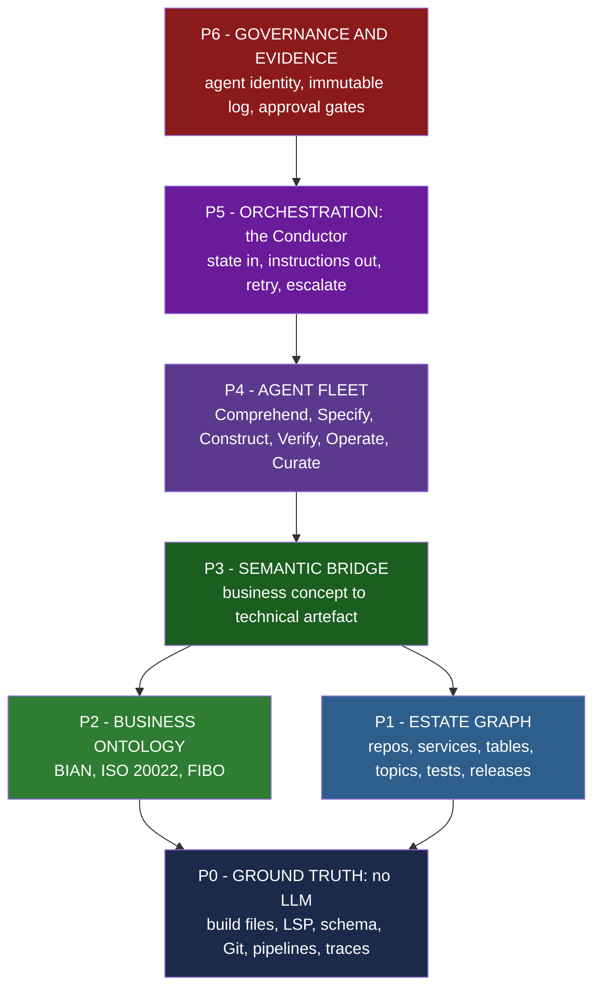

# Ontology-Grounded Agentic Engineering for Regulated Core Banking Delivery

### A methodology and evidence review for the ING Core Banking / BTA Payments programme

**Authors:** HCLTech Core Banking — BTA Payments
**Version:** 2.0 · **Date:** September 2026
**Classification:** Internal

---

## Abstract

Enterprise adoption of AI coding agents has outpaced the evidence base supporting it. The
prevailing deployment pattern — point a capable model at a repository, engineer the prompt,
measure self-reported velocity — fails predictably at enterprise scale for a reason that is
structural rather than incidental: the agent has no model of the system it is modifying. This
paper reviews the primary evidence on AI-assisted software productivity, synthesises six
independent practitioner accounts of large-scale agentic engineering, and analyses one
peer methodology (Sahaj Software's reverse-engineering pipeline) alongside our own production
deployment on the ING BTA Payments stream. We find strong convergence on a single conclusion:
**context, not model capability, is the binding constraint**, and the durable remedy is a
persistent, governed semantic substrate — a knowledge graph joining a technical model of the
estate to a business ontology grounded in banking standards.

We propose **PRIME.AI v2**, a seven-plane architecture that separates deterministic extraction
from cognitive reasoning, isolates agent roles, orchestrates via a state-only conductor, and
treats requirement-to-release traceability as a first-class graph artefact serving engineering
and audit simultaneously. We report honestly on the limits of our own measurement, identify the
conditions under which the approach should *not* be built, and specify a four-stage adoption
path whose first stage carries no AI risk.

**Keywords:** knowledge graph, ontology, agentic SDLC, context engineering, core banking,
ISO 20022, BIAN, neuro-symbolic AI, regulated software delivery

---

## Evidence conventions

Every claim in this paper carries a tier. This convention exists because the paper is intended
to survive hostile technical review by a systemically important bank.

| Tier | Meaning |
|---|---|
| `T1` | Independent — peer-reviewed, RCT, regulator, or standards body |
| `T2` | Credible but interested — vendor engineering blog, practitioner conference talk |
| `T3` | Our own measurement on the BTA Payments engagement |
| `T4` | Design intent — what we propose, never stated as achievement |

Claims about ING's internal estate that are not publicly verifiable are marked
`[ASSUMPTION — validate with client]` and are never presented as fact.

---

## 1. Introduction

### 1.1 The problem this paper addresses

A core banking payments transformation presents a specific and unusually difficult combination
of constraints:

1. **Scale beyond individual comprehension.** No single engineer holds the whole payments
   estate in working memory. Neither does a language model: the context window is a fixed
   container, and exceeding it triggers compaction, then forgetting, then confabulation.
2. **Knowledge decay.** Domain knowledge lives in people. When they leave, it leaves.
3. **Documentation drift.** Written documentation is stale on arrival and diverges
   monotonically from the running system.
4. **Externally imposed deadlines.** Payments regulation does not negotiate schedule.
5. **Mandatory evidentiary chains.** Every production change must be traceable —
   requirement → design → code → test → approval → deployment — to internal audit and to the
   prudential supervisor.

Items 1–3 are knowledge-representation problems. Item 5 is a traceability problem. We argue
that all four are the same problem, and that it is a graph problem.

### 1.2 Why the naive deployment pattern fails

The dominant enterprise pattern — a fleet of task-specialised generative agents, each
configured by prompt files, each reading source artefacts directly — produces a specific
failure signature at scale. Agents fill their context with raw material, lose earlier
instructions to compaction, and begin generating plausible but unfounded output. Because the
output is fluent, the failure is not self-announcing; it surfaces later as defect load
concentrated on the small number of reviewers who actually understand the system.

This is not a prompt-quality problem. As Nawathe (Sahaj Software) puts it, it is a physics
problem: a fixed-size processing container asked to hold an unbounded amount of code `T2`.

### 1.3 Contributions

1. A synthesis of six independent practitioner accounts converging on context as the binding
   constraint (§3).
2. A corrected reading of the primary productivity evidence, including the supersession of the
   most-cited counter-result (§2).
3. A seven-plane reference architecture for ontology-grounded agentic SDLC (§5).
4. A published deterministic/cognitive task split as a design rule (§6).
5. A measurement model pairing every velocity metric with a stability metric (§8).
6. An honest statement of the conditions under which this should not be built (§9).

---

## 2. The evidence base on AI-assisted software productivity

### 2.1 The METR randomised controlled trial, and its 2026 supersession

The most methodologically serious study in this field is METR's randomised controlled trial of
experienced open-source developers `T1`.

**Study 1 (early 2025).** Sixteen experienced developers worked 246 real issues drawn from
repositories they had contributed to for years (averaging 22,000+ stars and 1M+ lines of code).
Each issue was randomly assigned to AI-allowed or AI-disallowed. Tasks averaged approximately
two hours; sessions were screen-recorded; participants were paid $150/hr; tooling was primarily
Cursor Pro with Claude 3.5/3.7 Sonnet.

**Result:** developers took **19% longer** when AI was allowed (CI +2% to +39%). The
perception gap is the more important finding: developers *expected* a 24% speed-up and, after
experiencing the slowdown, still believed they had been **20% faster**.

> Source: https://metr.org/blog/2025-07-10-early-2025-ai-experienced-os-dev-study/ ·
> paper https://arxiv.org/abs/2507.09089

**Study 2 (published 24 February 2026) supersedes it.** The original page now carries the
banner *"These results are out of date."* The follow-up ran from August 2025 with 57
developers, 143 repositories and 800+ tasks, at a reduced $50/hr rate.

**Result: the direction reversed.** Returning developers showed an **18% speed-up**
(CI −38% to +9%); newly recruited developers showed a **4% speed-up** (CI −15% to +9%).

**However, METR disclaims its own new data.** It calls the result *"an unreliable signal"*,
because developers increasingly declined to participate rather than work without AI, and 30–50%
of participants admitted withholding tasks they did not want to attempt unaided. Both effects
bias the measured speed-up downward, so METR states the estimate is likely a **lower bound**.

> Source: https://metr.org/blog/2026-02-24-uplift-update/

**Implication for practice.** Citing "AI makes developers 19% slower" as present-tense fact is
now incorrect and would be identified as such by any well-read technical reviewer. The durable
finding from both studies is not the direction of the effect but the **unreliability of
self-report**: in study 1, developers' belief about their own productivity was wrong by
approximately 40 percentage points. Any methodology that reports self-assessed productivity
gains is, on this evidence, reporting noise.

### 2.2 The finding that reframes the entire problem

METR's own discussion of study 1 offers this explanation for the slowdown `T1`:

> *"Our results also suggest that AI capabilities may be comparatively lower in settings with
> very high quality standards, or with many implicit requirements (e.g. relating to
> documentation, testing coverage, or linting/formatting) that take humans substantial time to
> learn."*

Mapped against the ING BTA Payments context:

| METR's stated condition for underperformance | Present in this programme? |
|---|---|
| Very high quality standards | Yes — regulated payments under supervision |
| Many **implicit** requirements | Yes — FSAs, Forge coding standards, INGenious conventions, scheme rules, internal controls |
| Requirements taking substantial time to learn | Yes — this is precisely the onboarding cost |
| Developers with deep existing codebase knowledge | Partly — true for veterans, false for new joiners and cross-team work |

METR has, in effect, published a specification of the conditions under which agentic AI
underperforms. **Every condition it names is a condition of implicit, unwritten knowledge.**

This is the central argument of this paper. Making implicit knowledge explicit — in a governed,
queryable model that agents consult before acting — targets the stated cause rather than
disputing the finding.

**Honest scoping.** METR's developers knew their codebases deeply and were still slowed. The
claim must therefore be bounded: a semantic substrate helps most where human context is
*scarce* (new joiners, unfamiliar modules, cross-team dependencies, legacy components) and
least where an expert works in code they themselves wrote.

### 2.3 What this means for our own reported numbers

Our BTA Payments deployment observed endpoint delivery moving from 2 sprints to 1.4 sprints
`T3`. Applying the discipline above, we note explicitly:

- The velocity observation was not accompanied by measurement of defect escape rate, change
  failure rate, or rework/churn.
- Without the stability half of the measurement, the velocity figure is not a quality-neutral
  productivity claim and should not be presented as one.
- The baseline definition (which sprints, which stories, which definition of done) must be
  restated before the figure is used externally. `[ASSUMPTION — validate with client]`

We regard publishing this limitation as a precondition for the figure being believed at all.

---

## 3. Convergent practitioner evidence

We reviewed six independent conference talks by practitioners solving large-scale agentic
engineering problems from materially different vantage points: a graph database CEO, a Berkeley
academic, a platform engineer sceptical of AI, and three engineering organisations doing
production reverse-engineering work. Full transcripts and a detailed distillation are held in
`research/raw/thread-E-talks-distilled.md`.

### 3.1 The sources

| Source | Role | Core claim |
|---|---|---|
| Harshad Nawathe, Sahaj Software | Practitioner | Context is a finite container; ground agents deterministically |
| Emil Eifrem, Neo4j | Vendor `T2` | Thin agents on a smarter shared substrate |
| Frank Coyle, UC Berkeley | Academic | Ontology as symbolic guardrail on probabilistic output |
| Kelsey Hightower, PlatformCon | Sceptic | Infer once, export, run without inference |
| Matt Pocock | Educator | Good codebases compound AI; shared ubiquitous language |
| Blitzy AI | Practitioner | "The gap isn't the model — it's the context" |

### 3.2 The eleven points of convergence

Abbreviated from the full distillation. Each is asserted independently by at least three of the
six sources.

1. **Context, not model choice, is the bottleneck.** Model capability is commoditising; context
   engineering is the differentiator.
2. **The context window is finite and fragile.** Never dump raw material; disclose
   progressively. Sahaj's "Four Perils" — context contamination, low signal-to-noise, lost in
   the middle, attention dilution — name the failure modes precisely.
3. **Deterministic grounding.** Use compilers, parsers, language servers and graphs for
   *structure*; reserve the model for *meaning*. Nawathe: *"Don't burn context tokens on work a
   compiler does for free."*
4. **A knowledge graph is the scaling substrate.** Eifrem's three-pillar semantic layer,
   Coyle's ontology-as-validator, Sahaj's symbol index and Blitzy's dynamic knowledge graph are
   four names for one architectural idea.
5. **A shared, business-facing ubiquitous language.** Eifrem: a `Customer` has a `first name`,
   not an `f_name`.
6. **Markdown is necessary but not sufficient.** Eifrem: markdown and skills are *"part of the
   solution, but not the solution."* Notably Pocock — usually cast as the markdown advocate —
   agrees at the deepest level: the shared design concept is *"not something you can put in a
   markdown file."*
7. **Thin, role-isolated agents under a lean orchestrator.** Specialise the agents, centralise
   the state, keep every context narrow.
8. **Validation and human gates over probabilistic output.** Nothing generated is trusted
   un-validated.
9. **Economics are first-class.** Sahaj: *"Respect the economics… the full pipeline justifies
   its cost only when a holistic view is needed."*
10. **Fundamentals endure; AI is a layer on top of the substrate.** Hightower: agents sitting
    atop bad infrastructure *"just burn tokens."*
11. **Living documentation versus drift.** Blitzy: *"the map goes out of date almost as fast as
    you can drive."*

### 3.3 The two genuine tensions

**Tension 1 — should agents read code at all?** Sahaj mandates that agents essentially never
read raw source (Layers 0–1 read only tool output; Layers 2–3 perform "surgical reads only").
Blitzy deploys LLM agents to ingest code directly. We reconcile these by observing that both
make *the graph the durable artefact* and both serve agents just-in-time slices; they differ
only on how the graph is populated. Our position: **default to deterministic construction**
(cheaper, auditable, reproducible), and reserve model-based ingestion for the genuinely
semantic residue that no parser can recover — buried business rules, bespoke middleware
conventions, undocumented exception handling.

**Tension 2 — markdown versus graph.** Reconciled by layering: **markdown is the human-facing
projection; the graph and its execution traces are the machine-facing source of truth.** They
are strata of one system, not competing options.

### 3.4 Steelmanning the sceptical position

Hightower's "Zero Token Architecture" is the argument a sharp bank CTO will make, and it
deserves to be stated at full strength rather than dismissed `T2`:

- Most AI agents *"sit as a layer on top of the existing thing"* — if the underlying estate is
  poorly maintained, the agent burns tokens without fixing the cause.
- AI risks providing *"air cover"* for deferring structural work that should simply be done.
- There is an ongoing, recurring token cost to work that could be made deterministic once.
- There are deskilling and codependency risks in the engineering organisation.

We accept all four. Notably, Hightower's prescription — *"infer once, export, and run without
inference"* — is **the economic argument for our architecture**, not against it. Building the
graph once through deterministic extraction, and querying it thereafter, is exactly the pattern
he advocates. His critique lands squarely against the naive pattern described in §1.2 and
substantially less against the architecture proposed here. The deskilling concern, however,
remains genuinely unresolved and is retained in §9 as an open risk.

---

## 4. Analysis of a peer methodology

Sahaj Software's publicly presented pipeline is the strongest comprehension-focused agentic
methodology we identified, and any credible proposal must be measured against it.

### 4.1 Their architecture

Five layers, eleven agents, one orchestrator:

| Layer | Agents | Reads | Code access | Produces |
|---|---|---|---|---|
| 0 | Scout | Build files only | **Never** | Project skeleton, module map |
| 1 | Cartographers | Scout output | **Never** — tool output only | Symbol index, static relationships |
| 2 | Specialists — Archaeologist, Taxonomist, BeanStalkJack | Symbol index | Surgical reads only | Entity models, bean graphs, taxonomies |
| 3 | Surveyors — Port Mapper, Surveyor, Choreographer | Layer-2 artefacts | Surgical reads only | Service boundaries, integration topology, workflows |
| 4 | Chronicler | All prior artefacts | **None** | Complete domain documentation |
| — | **Conductor** | **Pipeline state only** | None | Scheduling, scaling, retry/replan/escalate |

Their four context-engineering principles — **progressive disclosure, deterministic grounding,
role isolation, subagent isolation** — are, in our assessment, correct and directly adoptable.

Their reported output: 10,000+ classes indexed, 200+ documents (~15MB), 400+ database tables
mapped, 80+ REST and 60+ SOAP endpoints catalogued, 15+ service boundaries, 80+ workflow
traces, C4 diagrams at three levels, with incremental regeneration via input fingerprinting
`T2`.

### 4.2 Where it is stronger than our v1

Candidly: on context engineering, orchestration, the deterministic/cognitive split, role
isolation, legacy comprehension, and honesty about economics. Our v1 addressed none of these
explicitly.

### 4.3 The structural limitation

**Their output is documents. The output should be a model.** Three consequences follow:

1. **Documents do not compose.** One cannot ask 200 markdown files *"which services participate
   in the SEPA Instant flow and which of them lack regression coverage?"* One can ask a graph.
2. **Documents lack identity and history.** Fingerprint-based regeneration refreshes
   *artefacts*; it does not maintain a *model* in which nodes persist, so "what changed, when,
   and why" is unanswerable.
3. **There is no business layer.** A symbol index and a code-concept taxonomy is not a domain
   ontology. Nothing connects `PaymentProcessorImpl` to *SEPA Instant Credit Transfer*, to the
   regulation mandating it, to the requirement specifying it, or to the test proving it.

The third point is the decisive one, and it is the gap our proposal occupies.

---

## 5. Proposed architecture: PRIME.AI v2

### 5.1 Thesis

> We build and maintain one governed, living model of the payments estate, and run thin,
> specialised, accountable agents on top of it.

### 5.2 Re-grounding the acronym

Each letter now names a principle the methodology can be held to. Two are adopted from Sahaj
with attribution; three are ours.

| | Principle | Origin |
|---|---|---|
| **P** | **Progressive disclosure** — an agent receives the minimum structured slice its role requires | Sahaj `T2` |
| **R** | **Role isolation** — one agent, one competency, one narrow context | Sahaj `T2` |
| **I** | **Intent traceability** — regulation → requirement → story → code → test → release, linked in the graph | Ours |
| **M** | **Model-grounded** — grounded in the bank's domain model, not merely a language model | Eifrem, Coyle, Sahaj |
| **E** | **Evidenced** — every velocity claim paired with a stability claim | Forced by §2 |

### 5.3 The seven planes

**P0 — Ground truth.** Deterministic extraction only; no model touches this plane. Build
introspection, tree-sitter/LSP symbol resolution, dependency analysis, OpenAPI/WSDL contracts,
database schema, topic topology, Git history, pipeline metadata, distributed traces.

**P1 — Estate graph.** The technical ontology: repositories, modules, classes, methods,
endpoints, tables, columns, topics, configuration, tests, pipelines, environments, releases,
work items, pull requests, commits, defects, incidents — with persistent node identity so
change is observable.

**P2 — Business ontology.** Adopted, not invented:
- **BIAN** — the Banking Industry Architecture Network service-domain landscape. Version 12.0
  includes a Payments business-scenario category `T1` (https://bian.org/servicelandscape-12-0-0/).
- **ISO 20022** — the payments message model (`pacs`, `pain`, `camt`) already mandated across
  SEPA, T2 and CBPR+, and therefore already spoken by ING's engineers `T1`.
- **FIBO** — the EDM Council's Financial Industry Business Ontology, for instrument and party
  concepts `T1`.

Adopting standards rather than authoring a bespoke ontology converts the highest-perceived-risk
element of the proposal into its lowest.

**P3 — Semantic bridge.** The join between P1 and P2, and the plane that makes the whole
architecture worth building. It serves three audiences from one structure:

| Audience | Question answered |
|---|---|
| Engineer | "What breaks if I change this?" |
| Delivery lead | "What is actually left to build for this scheme?" |
| Auditor / supervisor | "Show me the evidence chain for this change." |

**P4 — Agent fleet.** Organised by function rather than by job title:

| Family | Purpose | New in v2? |
|---|---|---|
| Comprehend | Understand the existing estate | **Yes** |
| Specify | Requirement → story → acceptance criteria | No |
| Construct | Produce the change | No |
| **Verify** | **Independently** check the change | **Yes** |
| Operate | Reproduce, triage, root-cause, fix | No |
| **Curate** | Keep the graph true, fresh, non-contradictory | **Yes** |
| **Govern** | Assemble evidence, enforce policy | **Yes** |

Two additions are structurally necessary. **Verify must be independent of Construct** — a
generator marking its own work is not a control. **Curate** is what distinguishes a living model
from a one-off extraction; without it the architecture degrades into Sahaj's documentation set
with additional steps.

**P5 — Orchestration.** The Conductor pattern, adopted from Sahaj: hub-and-spoke, state flows
in and instructions flow out, the orchestrator holds *pipeline state only and never content* so
it cannot be contaminated by the material it coordinates. Failure is a designed state — retry,
replan, or escalate to a named human with context preserved.

**P6 — Governance and evidence.** Agent identity as first-class named principals with
least-privilege credentials; immutable action logging; approval gates encoded as policy rather
than convention; named human accountability for every production change; on-demand generation
of audit evidence packs from the traceability graph.

---

## 6. The deterministic/cognitive split as a published design rule

Publishing where AI is *not* used is, in our assessment, the fastest available route to being
trusted about where it is.

| SDLC activity | Deterministic tool | LLM agent | Rationale |
|---|---|---|---|
| Parse code, resolve symbols, build call graph | ✅ | ❌ | Solved by compilers decades ago |
| Dependency and impact analysis | ✅ | ❌ | Exact graph traversal |
| Schema / contract diff, breaking-change detection | ✅ | ❌ | Must be exact |
| Lint, static analysis, SAST | ✅ | ❌ | Already deterministic in pipeline |
| Test execution and coverage measurement | ✅ | ❌ | Must be reproducible evidence |
| Traceability link maintenance | ✅ | ❌ | Derived from identifiers, not judgement |
| Infer meaning of legacy code | ❌ | ✅ | Genuinely semantic |
| Requirement → story with acceptance criteria | ❌ | ✅ | Language, ambiguity, judgement |
| Boundary / bounded-context proposal | ❌ | ✅ | Judgement, always human-ratified |
| Author the change | ❌ | ✅ | Synthesis under constraint |
| Test design (execution remains deterministic) | ❌ | ✅ | Requires understanding intent |
| Defect root-cause narrative | ❌ | ✅ | Correlation across noisy sources |

> **Rule:** *if a compiler, parser or query could answer it, a language model is not asked to.*

This single rule simultaneously addresses three distinct objections — token cost, output
accuracy, and auditability.

---

## 7. The ontology as a validator (neuro-symbolic guardrail)

Coyle's contribution is that an ontology is not only a retrieval structure but a **symbolic
check on probabilistic output** `T2`. His illustrative constructs map directly onto payments
failure modes:

| Ontology construct | Class of error caught |
|---|---|
| Functional property (at most one) | A second refund raised against the same payment |
| Disjoint classes | A payout routed to a support representative rather than the beneficiary |
| Enumerated value range | An invented status such as *"probably settled"* |
| Domain / range constraints | A relationship asserted between incompatible entity types |

The control sequence is: agent proposes → ontology adjudicates → only then does the artefact
reach a human gate. Coyle's formulation — *"Pydantic at the door, ontology at the ledger"* —
captures the layering. In payments these are not academic examples; they are the defect classes
that cost money and attract supervisory attention.

---

## 8. Measurement model

The bare percentage badges used in v1 (`~30%`, `~25%`, `~35%`) are not defensible: they lack a
denominator, a baseline, a method and a population. §2 establishes further that self-reported
productivity is unreliable in a measurable and directional way.

We therefore propose that **every velocity metric is reported alongside its stability partner**,
and that no velocity figure is ever published alone.

| Dimension | Velocity metric | Paired stability metric |
|---|---|---|
| Flow | Lead time for change; cycle time per story | Change failure rate |
| Quality | Defect detection in-sprint | Defect escape rate to ST/SIT/production |
| Rework | First-time-right rate on PRs | Code churn within 21 days |
| Coverage | Coverage delta | Mutation score / assertion quality |
| Review | Review turnaround time | Review depth; % changes materially amended |
| Comprehension | Onboarding time to first merged PR | Graph freshness and estate coverage |
| Cost | Cost per accepted story | Token and tooling cost per accepted change |

Every reported figure states **baseline · method · population · period**. Bare percentages are
prohibited.

---

## 9. Limits, risks, and when not to build this

### 9.1 When the full substrate is justified

When the estate exceeds individual comprehension; when multiple squads and multiple years are
involved; when the same questions are repeatedly asked by different people; when traceability
must be evidenced to a supervisor; when the system will be decomposed or migrated.

### 9.2 When it is not

When the scope is a handful of well-understood repositories; when the work is genuinely
greenfield; when the team already holds the model in its head and turnover is low; when the
programme concludes before the substrate would repay its construction cost.

> *"Respect the economics. Match the instrument to the problem."* — Nawathe, Sahaj `T2`

### 9.3 Open risks we do not claim to have solved

1. **Ontology maintenance burden.** A business ontology that is not curated decays like any
   other documentation. The Curate agent is a mitigation, not a solution; ownership must be
   assigned on the client side.
2. **Deskilling.** Hightower's concern is unresolved. Delegating comprehension to a substrate
   may erode the organisation's ability to reason without it.
3. **Graph as a mirror, not a remedy.** A knowledge graph maps a poorly structured estate
   faithfully; it does not improve it. Structural remediation remains separate work.
4. **Extraction fidelity limits.** Dynamic dispatch, reflection, runtime configuration and
   string-driven behaviour resist static extraction. The graph will have known blind spots and
   must record them explicitly rather than presenting false completeness.
5. **Review burden increases.** Higher artefact throughput increases reviewer load. This is
   the principal reason Verify exists, and it should be measured, not assumed away.

### 9.4 What we explicitly do not claim

- That agents author production payment logic unsupervised. A human approves every change.
- That any stated percentage of code is "AI-written" — a framing we consider actively harmful
  in a supervised context.
- That the ontology will be complete at inception. It covers payments and grows by use.
- That every engineer becomes faster. §2.2 indicates otherwise for unfamiliar codebases, which
  is the condition the architecture is designed to remove.

---

## 10. Adoption path

| Stage | Builds | Delivers | Risk profile |
|---|---|---|---|
| **1. Map** (weeks 1–4) | P0 + P1, deterministic extraction only | Queryable map of the payments stream: dependencies, endpoints, tables, topics, coverage gaps | **No AI risk** |
| **2. Mean** (weeks 5–12) | P2 + P3, BIAN/ISO 20022 grounding | "Show everything implementing SEPA Instant, with its test evidence" | Standards adoption, not invention |
| **3. Work** (months 3–6) | P4 + P5; existing agents re-pointed at the graph; Verify and Curate added | Better-grounded agents; independent verification; a model that stays current | Measurable against stage-1 baseline |
| **4. Govern & scale** (month 6+) | P6; extension beyond payments | Evidence packs on demand; a substrate reusable across squads | Becomes an owned asset |

The sequencing is commercially deliberate: **stage 1 carries no AI risk whatsoever**, making it
the lowest-barrier approval available, while producing the artefact that reduces the cost of
every subsequent stage.

---

## 11. Conclusion

The evidence does not support the proposition that deploying capable models against enterprise
codebases reliably improves delivery. It supports a narrower and more actionable proposition:
**agentic engineering succeeds to the degree that the implicit is made explicit.** METR's
randomised trial locates AI underperformance precisely in settings of high standards and
unwritten requirements. Six independent practitioner accounts converge on context as the
binding constraint. A peer methodology demonstrates that disciplined context engineering works,
while stopping short of a composable, business-grounded model.

PRIME.AI v2 proposes that the durable asset in an AI-assisted transformation is not the agent
fleet, the prompt library, or the model contract — all of which are replaceable and rapidly
commoditising — but the **governed semantic substrate** the agents stand on. That substrate is
simultaneously an engineering instrument and a compliance instrument, which is what makes it
economically defensible in a regulated bank.

The proposition can be falsified cheaply. Stage 1 requires four weeks, uses no AI, and produces
a queryable map whose usefulness the client can assess directly before committing to anything
further.

---

## References

**Primary — randomised and independent**
1. METR (2025). *Measuring the Impact of Early-2025 AI on Experienced Open-Source Developer Productivity.* https://metr.org/blog/2025-07-10-early-2025-ai-experienced-os-dev-study/ · arXiv: https://arxiv.org/abs/2507.09089
2. METR (2026). *Uplift Update*, 24 February 2026. https://metr.org/blog/2026-02-24-uplift-update/

**Standards bodies**
3. BIAN. *Banking Industry Architecture Reference Model v12.0 — Service Domain Landscape.* https://bian.org/servicelandscape-12-0-0/
4. ISO 20022. Universal financial industry message scheme. https://www.iso20022.org/
5. EDM Council. *Financial Industry Business Ontology (FIBO).* https://spec.edmcouncil.org/fibo/

**Research and engineering**
6. Edge, D. et al. (2024). *From Local to Global: A Graph RAG Approach to Query-Focused Summarization.* arXiv:2404.16130. https://arxiv.org/abs/2404.16130
7. Microsoft Research. *GraphRAG documentation.* https://microsoft.github.io/graphrag/

**Practitioner talks (primary sources, transcripts retained in `research/raw/transcripts/`)**
8. Nawathe, H. (Sahaj Software). *The Practical Guide to Reverse Engineering XXL Codebases with Agentic AI.* https://www.youtube.com/watch?v=FCODql2UWM8
9. Eifrem, E. (Neo4j). *Thinner Agents on a Smarter Substrate: The Ontology-based Semantic Layer.* https://www.youtube.com/watch?v=VGN22pPpb-8
10. Coyle, F. (UC Berkeley). *Why Agentic Systems Need Ontologies.* https://www.youtube.com/watch?v=Sir59K8ZDPU
11. Hightower, K. *ZTA: Zero Token Architecture*, PlatformCon 2026. https://www.youtube.com/watch?v=A7WFt2JQ5sg
12. Pocock, M. *Software Fundamentals Matter More Than Ever.* https://www.youtube.com/watch?v=v4F1gFy-hqg
13. Blitzy AI. *Reverse Engineering Enterprise Codebases at Scale.* https://www.youtube.com/watch?v=1RM1XlDbYiA

**Foundational works referenced**
14. Evans, E. *Domain-Driven Design: Tackling Complexity in the Heart of Software.*
15. Ousterhout, J. *A Philosophy of Software Design.*
16. Gruber, T. (1993). *A translation approach to portable ontology specifications.* — ontology as "a formal specification of a shared conceptualization"

---

## Appendix A — Internal working papers

| Document | Contents |
|---|---|
| `research/01-baseline-and-gap-analysis.md` | Full transcription of the v1 deck; ten-point weakness analysis; head-to-head against Sahaj |
| `research/02-methodology-architecture.md` | Extended architecture design document |
| `research/03-slide-deck-content.md` | Client-facing slide contents with speaker notes |
| `research/raw/thread-E-talks-distilled.md` | 9,800-word distillation of all six practitioner talks |
| `research/raw/evidence-note-01-metr.md` | Verification note on the METR studies |
| `research/raw/sahaj-deck.txt` | Extracted text of the Sahaj deck (25 pages) |
| `research/raw/transcripts/` | Full transcripts of all six talks |
| `research/diagrams/` | Rendered and validated Mermaid diagrams |

## Appendix B — Assumptions requiring client validation

1. Which graph technology is permitted within ING's approved technology estate.
2. Where source-code-derived artefacts may be processed and stored, and under which
   model-hosting arrangement.
3. Whether ING already maintains a BIAN- or ISO-20022-aligned service catalogue that should be
   adopted rather than derived.
4. The precise baseline underlying the existing 30% figure.
5. Ownership of the substrate following the engagement.
6. Controls presently applying to non-human actors in the delivery pipeline.
