# The Semantic Substrate — Technical Deep Dive
### Knowledge graph and ontology design for ING Core Banking / BTA Payments

**Audience.** Architects, tech leads, principal engineers, and the technical members of the
review board. This is the annex behind slides 8–14 of the business deck. It answers the
question a business slide cannot: *"Fine — but what is actually in this graph, how does it get
there, and what does it let me do that I cannot do today?"*

**Companion documents:** [`03-slide-deck-content.md`](03-slide-deck-content.md) (the pitch) ·
[`04-research-paper.md`](04-research-paper.md) (the evidence)

**Rendered diagrams:** every Mermaid block below is exported to `diagrams/tech/` as `.png` and
`.svg`, render-verified. Use them directly in slides.

---

## Contents

| § | Section | Key diagram |
|---|---|---|
| 1 | The one-sentence thesis, and what a graph buys you | T1 |
| 2 | The three-layer stack | T2 |
| 3 | The metamodel — every node type and every edge type | T3a, T3b, T4 |
| 4 | How the graph gets built — the extraction pipeline | T5 |
| 5 | Worked example: Verification of Payee | T6 |
| 6 | How an agent actually uses it — the retrieval contract | T7, T8 |
| 7 | The ontology as a validator | T9 |
| 8 | Keeping it true — the curation loop | T10 |
| 9 | Queries that become possible | — |
| 10 | Physical design, sizing and technology choice | T11 |
| 11 | Known blind spots | — |

---

## 1. The thesis, stated technically

> Today, every agent, every engineer and every auditor **re-derives** their understanding of
> the payments estate from raw artefacts, in private, and throws it away.
> We propose to derive it **once**, deterministically, into a persistent typed graph, and serve
> it back as bounded slices.

### 1.1 Why a graph and not a document set, a vector store, or a wiki

This is the first question a good architect asks. The honest comparison:

| Store | Answers "what is X?" | Answers "what breaks if I change X?" | Answers "prove X was tested" | Survives estate change |
|---|---|---|---|---|
| Wiki / Confluence | Sometimes, if fresh | No | No | No — drifts |
| Markdown doc set (Sahaj's output) | Yes | No — documents don't compose | No | Regenerated, not maintained |
| Vector store / RAG over code | Approximately | No — similarity is not dependency | No | Re-embed on change |
| **Typed property graph** | **Yes** | **Yes — exact traversal** | **Yes — traceability is an edge** | **Yes — nodes persist, diffs are observable** |

The decisive property is **multi-hop exactness**. "Which services implement SEPA Instant and
which of those have no regression coverage" is a 5-hop traversal with a negation. Vector
similarity cannot express it. A document set cannot express it. It is a trivial graph query.

The second decisive property is **node identity over time**. A regenerated document has no
memory. A graph node does: it has a first-seen date, a last-verified date, and an edit history,
which is what turns *"here is a map"* into *"here is what changed since your last release"*.

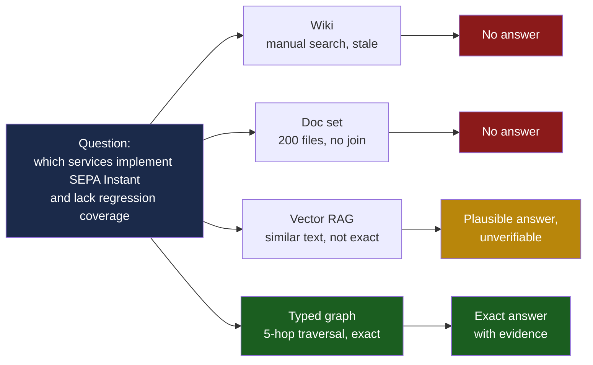
*Diagram T1 — why the store type is the decision, not the model.*

---

## 2. The three-layer stack

The substrate is not one graph. It is **two ontologies joined by a bridge**, sitting on
deterministically extracted ground truth.

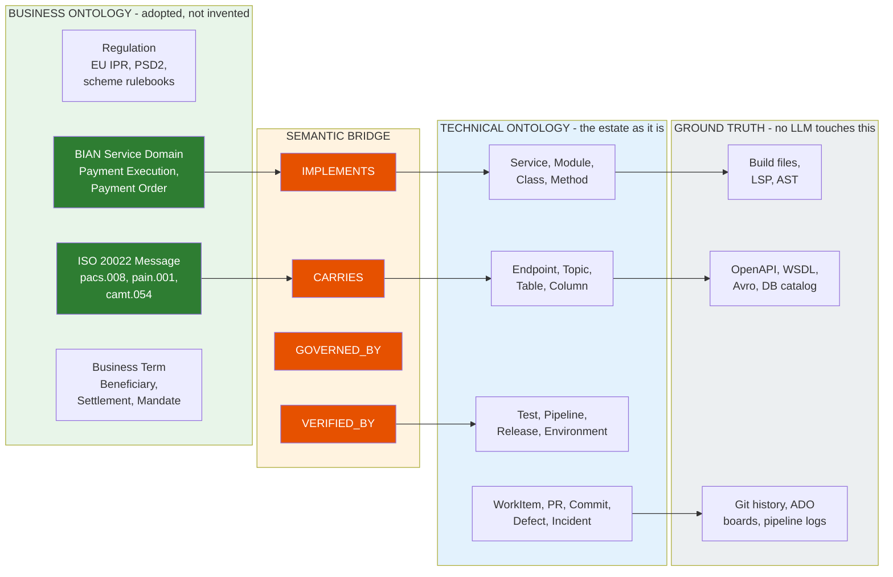
*Diagram T2 — the three-layer stack. The orange band is the part nobody else builds.*

**Read this diagram as the whole proposal.** The blue layer is what a code-analysis tool gives
you. The green layer is what a standards body gives you free. **The orange band is the entire
value of the engagement** — and it is the only part that has to be built rather than adopted.

### 2.1 Adopt, don't invent — the risk argument

The riskiest-sounding sentence in this proposal is "we will build an ontology of your bank."
It sounds like a two-year modelling project that ends in a binder nobody reads. So we don't
do that.

| Layer | Source | Why it is low risk |
|---|---|---|
| Payments message model | **ISO 20022** (`pacs`, `pain`, `camt`, `remt`) | Already mandated for SEPA, T2, CBPR+. Your engineers already speak it. The XSDs are machine-readable — the ontology is *generated*, not authored. |
| Business capability model | **BIAN Service Landscape v12.0** — includes a Payments category ([bian.org](https://bian.org/servicelandscape-12-0-0/)) | Published, versioned, bank-neutral, already used across tier-1 banks. |
| Party / instrument concepts | **FIBO** (EDM Council) | Open, OWL-native, maintained by an industry consortium. |
| ING-specific extension | Built with the client | Deliberately thin — only the concepts genuinely unique to ING. |

> **The line to use:** *"We are not asking you to let us model your bank. We are asking you to
> let us connect your code to a model the industry already published — and then to keep that
> connection true."*

---

## 3. The metamodel

### 3.1 Node types

Everything is typed. Nothing is a free-text blob.

| Layer | Node type | Key properties | Extracted from |
|---|---|---|---|
| **Business** | `Regulation` | id, name, jurisdiction, effectiveDate | Curated, human-ratified |
| | `ServiceDomain` | bianId, name, category | BIAN v12 landscape |
| | `MessageType` | isoCode, version, direction | ISO 20022 XSD |
| | `BusinessTerm` | canonicalName, definition, synonyms | FIBO + client glossary |
| | `BusinessProcess` | name, trigger, sla | FSA documents + human ratification |
| **Technical** | `Repository` | url, defaultBranch, owner | Azure DevOps API |
| | `Module` | name, buildTool, language, loc | Build file introspection |
| | `Service` | name, runtime, namespace, owner | OpenShift manifests, Helm |
| | `Class` / `Method` | fqn, signature, visibility, file, line | LSP / tree-sitter AST |
| | `Endpoint` | verb, path, contract, version | OpenAPI, WSDL |
| | `Topic` | name, partitions, schemaRef | Red Panda metadata, Avro registry |
| | `Table` / `Column` | schema, name, type, nullable, pii | DB information_schema |
| | `ConfigKey` | key, scope, environment | ConfigMaps, property files |
| | `Test` | id, type, suite, lastResult, duration | INGenious + pipeline results |
| | `Pipeline` / `Release` | id, stage, status, timestamp | Azure DevOps API |
| | `WorkItem` / `PR` / `Commit` | id, state, author, links | Azure DevOps + Git |
| | `Defect` / `Incident` | id, severity, rootCause, env | ADO + incident tooling |
| **Governance** | `Agent` | name, role, credentialRef, model | Agent registry |
| | `Approval` | approver, decision, timestamp, scope | Gate records |

### 3.2 Edge types

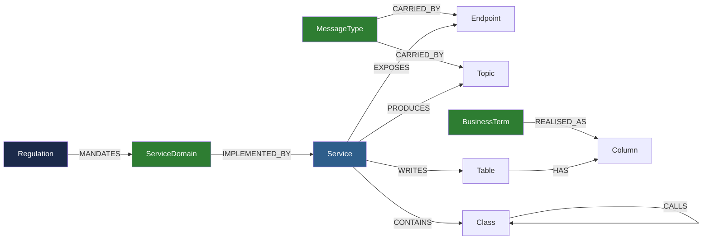
*Diagram T3a — the business-to-technical core. Green = business ontology, blue = technical.
Every edge is typed and every edge carries provenance.*

**T3b — the delivery and assurance chain.** The same graph continues into the delivery record.
This is the half that makes traceability a query rather than a spreadsheet.

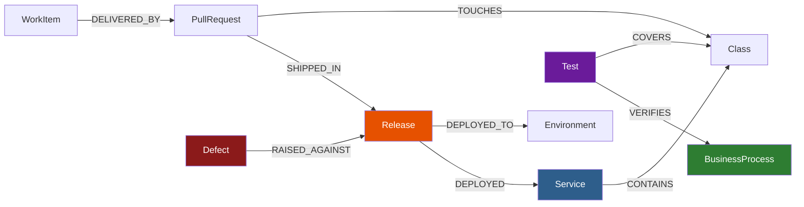


### 3.3 Provenance — the property set that makes it auditable

**Every node and every edge carries the same five provenance properties.** This is what
separates a knowledge graph from a diagram.

| Property | Example | Why it matters |
|---|---|---|
| `source` | `lsp:java`, `openapi:v3`, `ado:workitems`, `agent:archaeologist` | Tells you whether a model was involved |
| `extractor` | `cartographer@2.1.0` | Reproducibility |
| `extractedAt` | `2026-09-04T02:15:00Z` | Freshness |
| `confidence` | `1.0` deterministic · `0.0–1.0` inferred | **Deterministic and inferred facts are never mixed** |
| `evidence` | `PaymentRouter.java:214`, `commit a3f9c1` | An auditor can go and look |

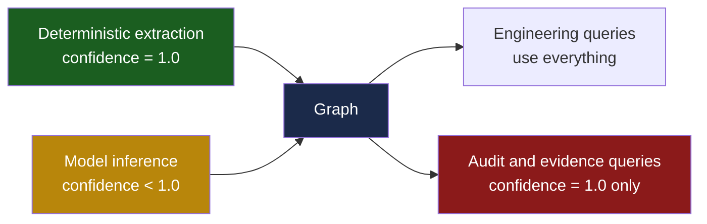
*Diagram T4 — the confidence split. An evidence pack never contains a model-inferred fact.*

> **This single design decision answers the compliance objection.** When someone asks "how do
> I know the AI didn't make this up?", the answer is: *the audit view filters on
> `confidence = 1.0`, and every fact in it points at a file, a line and a commit.*

---

## 4. How the graph gets built

Structured as layers, in the manner Sahaj demonstrated — but with one decisive difference:
**each layer writes into the graph rather than emitting a document.** The document is a
*projection* of the graph, produced last and on demand.

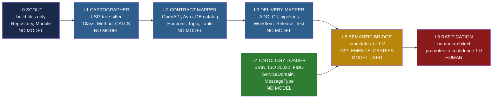
*Diagram T5 — the build pipeline. L0–L4 are deterministic: `confidence = 1.0`, no model, fully
reproducible. **Only L5 uses a model, and everything it proposes is ratified at L6.***

### 4.1 The layer contract, stated per layer

| Layer | Mission | Reads | Tools | Writes to graph | Model used? |
|---|---|---|---|---|---|
| **L0 Scout** | Establish the skeleton before anyone reads a line of code | `pom.xml`, `build.gradle`, `package.json`, Helm charts | Build tool introspection, glob | `Repository`, `Module`, `CONTAINS` | ❌ |
| **L1 Cartographer** | Resolve every symbol and static relationship | L0 nodes | LSP servers, tree-sitter, dependency analysers | `Class`, `Method`, `CALLS`, `DEPENDS_ON`, `IMPORTS` | ❌ |
| **L2 Contract Mapper** | Map every boundary the system exposes or consumes | L1 graph | OpenAPI/WSDL parsers, Avro registry, `information_schema` | `Endpoint`, `Topic`, `Table`, `Column`, `EXPOSES`, `PRODUCES`, `CONSUMES` | ❌ |
| **L3 Delivery Mapper** | Connect code to the delivery record | L2 graph | Azure DevOps REST, Git, pipeline API | `WorkItem`, `PR`, `Commit`, `Release`, `Test`, `Defect` + edges | ❌ |
| **L4 Ontology Loader** | Load the industry model | BIAN v12, ISO 20022 XSDs, FIBO OWL | XSD + OWL parsers | `ServiceDomain`, `MessageType`, `BusinessTerm`, `Regulation` | ❌ |
| **L5 Semantic Bridge** | Propose business-to-technical links | L1–L4 graph only | Deterministic candidate generation + LLM adjudication | `IMPLEMENTS`, `CARRIES`, `REALISED_AS`, `GOVERNED_BY` — all `confidence < 1.0` | ✅ |
| **L6 Ratification** | Human architect accepts or rejects each proposed link | L5 proposals | Review UI | Promotes accepted edges to `confidence = 1.0` | ❌ (human) |

> **Six of seven layers involve no model at all.** That ratio is the single most persuasive
> fact in this document for a risk audience — and it is a consequence of the design rule
> *"if a compiler, parser or query could answer it, a language model is not asked to."*

### 4.2 How L5 avoids being a hallucination engine

The bridge layer is where a naive implementation would simply ask a model *"which class
implements SEPA Instant?"* and believe the answer. We don't do that. L5 runs a
**generate-then-adjudicate** loop where the model only ever *chooses between deterministically
produced candidates* — it never invents an identifier.

1. **Deterministic candidate generation.** Lexical and structural signals produce a candidate
   set: ISO 20022 element names appearing in field names, BIAN service-domain terms in package
   and class names, endpoint paths, table and column names, config keys.
2. **Bounded adjudication.** The model receives the candidate set *and nothing else* — never
   the raw repository — and selects, rejects or abstains, with a stated rationale.
3. **Constraint check.** The proposal is validated against the ontology's own rules (§7). A
   proposal that violates a cardinality or disjointness constraint is discarded before a human
   ever sees it.
4. **Human ratification.** An architect confirms. Only then does the edge reach `confidence 1.0`.

Because the model can only ever pick from a list of things that verifiably exist, **the failure
mode is a wrong link, never an invented one** — and a wrong link is caught at step 3 or 4.
That distinction is the whole ballgame in a regulated estate.

---

## 5. Worked example — Verification of Payee

The abstract argument becomes concrete here. This is the slide that converts sceptics.

**The business ask:** *"Verification of Payee is mandated. Show me everything we have built for
it, prove it is tested, and tell me what breaks if we change the matching rule."*

Today that question costs a senior engineer two days, three Teams threads and a workshop.
Below is the subgraph that answers it in one query.

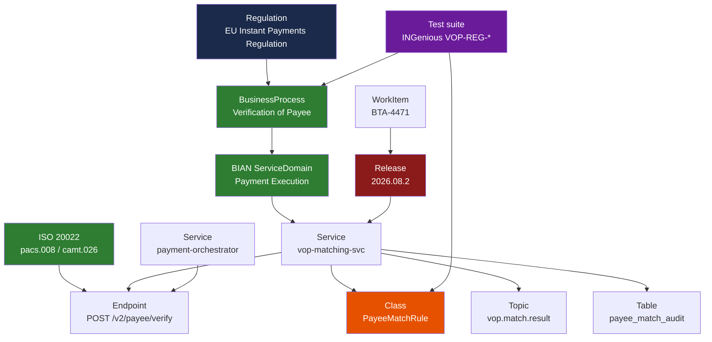
*Diagram T6 — one regulation, traced to the class that implements it, the test that proves it
and the release that shipped it. Illustrative structure — actual node names to be populated
from the client estate. `[ASSUMPTION — validate with client]`*

### 5.1 The three answers this single subgraph gives, to three different people

| Asked by | Question | Traversal | Answer |
|---|---|---|---|
| **Engineer** | "What breaks if I change `PayeeMatchRule`?" | `PayeeMatchRule` ← `CALLS*` ← `Service` → `EXPOSES` → `Endpoint`, plus `Topic` consumers | 2 services, 1 endpoint, 1 downstream topic consumer, 14 tests |
| **Delivery lead** | "What is left to build for VoP?" | `BusinessProcess` → `IMPLEMENTED_BY` → `Service`, minus those with a shipped `Release` | The unimplemented set, named |
| **Auditor** | "Prove VoP was tested before release 2026.08.2" | `Regulation` → `BusinessProcess` ← `VERIFIES` ← `Test` → result, filtered `confidence = 1.0` | Evidence pack, generated, not assembled by hand |

**Same graph. Same query engine. Three audiences.** That is the economic argument: the
substrate is paid for by engineering and *also* satisfies compliance, so it is charged to two
budgets and defended by two sponsors.

---

## 6. How an agent actually uses it

This is the part most "AI + knowledge graph" pitches skip, and the part your architects will
push hardest on. An agent does **not** get handed the graph. It gets handed a **context pack**:
a bounded, typed, provenance-carrying slice, assembled for its role.

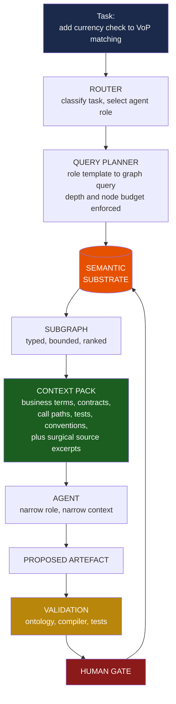
*Diagram T7 — the retrieval contract. Note the final edge: the outcome is written **back** into
the graph. The substrate learns from every change; the agents stay stateless.*

### 6.1 Progressive disclosure, quantified

The point of the substrate is not that the agent gets *more* context. It is that it gets
**dramatically less, of far higher relevance.**

| | Naive agent | Substrate-grounded agent |
|---|---|---|
| Input | Repository search results, whole files | Typed subgraph + surgical excerpts |
| Tokens per task | High and unbounded — grows with estate | **Bounded by role template, flat as estate grows** |
| Relevance | Similarity-ranked, unverified | Dependency-exact, provenance-carrying |
| Knows what it must not break | No | Yes — the blast radius is an edge traversal |
| Knows the domain term | Only if it appears in the code | Yes — from the ontology |
| Reproducible | No | Yes — same query, same slice |

> **The scaling claim, stated precisely:** naive context cost grows with the size of the
> estate; substrate-grounded context cost grows with the size of the *task*. On a payments
> estate of this scale, that is the difference between an approach that degrades as you succeed
> and one that doesn't. `T4 — design intent, to be measured in stage 3`

### 6.2 The role-to-query contract

Each agent role has a **fixed query template and a node budget**. It cannot widen its own
context — which is what makes the behaviour reproducible and the cost predictable.

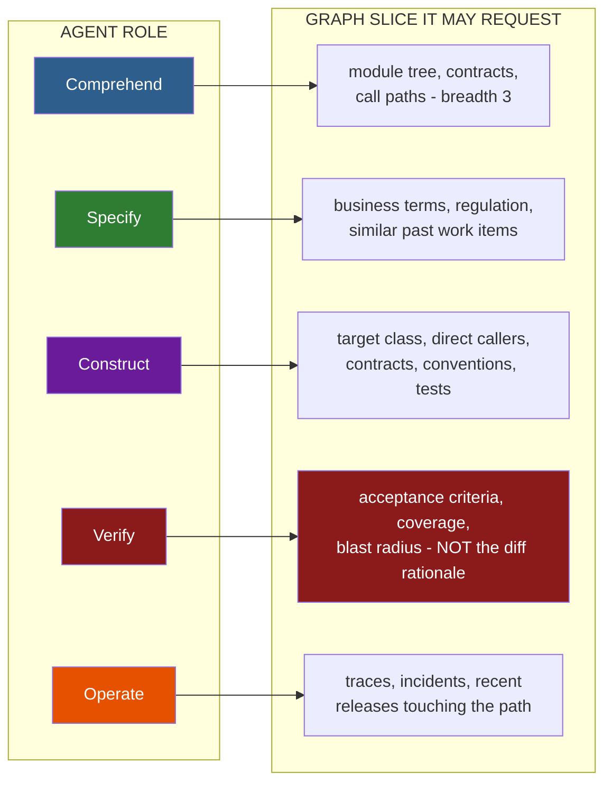
*Diagram T8 — role isolation is enforced by the query layer, not by prompt instruction.*

**The red path is the important one.** Verify is deliberately denied the Construct agent's
reasoning. It sees the requirement and the result, never the justification. A checker that has
read the author's excuse is not an independent check — and in a regulated estate, an
independent check is the control that regulators actually recognise.

---

## 7. The ontology as a validator

Beyond retrieval, the ontology is a **symbolic guardrail** over probabilistic output — the
neuro-symbolic pattern (Coyle, UC Berkeley `T2`). Constraints are expressed once, in the
ontology, and enforced on every agent proposal before a human ever sees it.

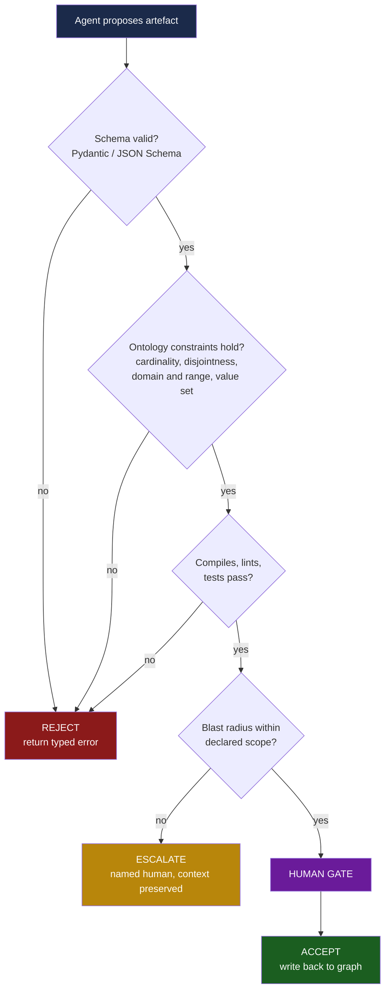
*Diagram T9 — four gates before a human is asked to spend attention. Rejections are cheap and
automatic; human review time is the scarce resource being protected.*

### 7.1 Constraints that catch real payments defects

These are not academic examples. Each maps to a defect class that costs money or attracts
supervisory attention.

| Ontology construct | Expressed as | Payments failure it prevents |
|---|---|---|
| **Functional property** (max cardinality 1) | `Payment hasSettlement max 1` | A second settlement or refund raised against the same payment |
| **Disjoint classes** | `Beneficiary owl:disjointWith InternalUser` | A payout routed to a support representative instead of the payee |
| **Enumerated value range** | `PaymentStatus in {PENDING, SETTLED, REJECTED, RETURNED}` | An invented status such as `"probably settled"` reaching a downstream consumer |
| **Domain / range constraint** | `debits domain Account, range Amount` | A relationship asserted between incompatible entity types |
| **Required provenance** | every audit-visible fact needs `evidence` | An unsourced claim entering an evidence pack |
| **Mandatory coverage** | `BusinessProcess mandatedBy Regulation` requires ≥1 `VERIFIES` edge | A regulatory obligation shipped with no test proving it |

> The last row is the one to say out loud in the room: **a regulatory obligation with no test
> edge is a graph constraint violation, and the pipeline can fail the build on it.** Compliance
> stops being a quarterly review and becomes a build-time check.

---

## 8. Keeping it true — the curation loop

A graph that is not curated decays exactly like a wiki, and everything above becomes worthless.
This is the honest weak point of every knowledge-graph proposal, so we address it structurally
rather than with good intentions.

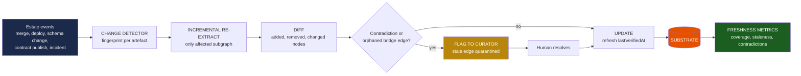
*Diagram T10 — curation is event-driven and incremental. A full re-extraction is a disaster
recovery procedure, not an operating model.*

### 8.1 Freshness is measured, published and owned

The graph reports on its own health. If these numbers are bad, the substrate is failing and
everyone can see it.

| Metric | Definition | Why it matters |
|---|---|---|
| **Estate coverage** | % of repositories in the payments stream with a current L0–L3 extraction | Are we mapping the whole estate or a convenient corner? |
| **Staleness p95** | Time since `lastVerifiedAt` for the 95th percentile node | Is the map current enough to trust? |
| **Bridge coverage** | % of `ServiceDomain` nodes with ≥1 ratified `IMPLEMENTS` edge | Is the business layer actually connected, or decorative? |
| **Contradiction count** | Open flagged conflicts awaiting curation | Is anyone maintaining this? |
| **Orphan rate** | Bridge edges whose technical endpoint no longer exists | Direct measure of decay |
| **Query latency p95** | On the standard role templates | Is it fast enough to sit in a developer loop? |

> **Failure mode we accept and design against.** If bridge coverage stalls below roughly 60%
> or the contradiction count grows monotonically for two sprints, the substrate is not being
> curated and the engagement should say so publicly rather than quietly serve a stale map.
> **A stale graph consulted with confidence is worse than no graph at all** — that is the
> strongest honest criticism of this entire approach, and the curation loop exists solely
> because of it.

---

## 9. Queries that become possible

The value is easiest to see as a list of questions that are currently expensive and become
cheap. Cypher-style, illustrative.

**Q1 — Regulatory coverage gap.** *Which mandated processes have no test proving them?*
```cypher
MATCH (r:Regulation)-[:MANDATES]->(p:BusinessProcess)
WHERE NOT EXISTS { (:Test)-[:VERIFIES]->(p) }
RETURN r.name, p.name
```

**Q2 — Blast radius before committing.** *What does changing this class actually touch?*
```cypher
MATCH (c:Class {fqn:$fqn})<-[:CALLS*1..4]-(caller)
MATCH (s:Service)-[:CONTAINS]->(caller)
OPTIONAL MATCH (s)-[:EXPOSES]->(e:Endpoint)
OPTIONAL MATCH (s)-[:PRODUCES]->(t:Topic)<-[:CONSUMES]-(d:Service)
RETURN DISTINCT s.name, collect(DISTINCT e.path), collect(DISTINCT d.name)
```

**Q3 — Untested blast radius.** *Where is change riskiest right now?*
```cypher
MATCH (c:Class)<-[:CALLS*1..3]-(impacted:Class)
WHERE NOT EXISTS { (:Test)-[:COVERS]->(impacted) }
RETURN c.fqn, count(DISTINCT impacted) AS uncoveredImpact
ORDER BY uncoveredImpact DESC LIMIT 20
```

**Q4 — Evidence pack, generated not assembled.** *Prove this change was controlled.*
```cypher
MATCH (r:Regulation)-[:MANDATES]->(p:BusinessProcess)<-[:VERIFIES]-(t:Test)
MATCH (p)<-[:IMPLEMENTS]-(s:Service)<-[:DEPLOYED]-(rel:Release {id:$release})
MATCH (wi:WorkItem)-[:DELIVERED_BY]->(pr:PullRequest)-[:SHIPPED_IN]->(rel)
MATCH (a:Approval)-[:APPROVED]->(pr)
WHERE ALL(x IN [t,s,rel,pr,a] WHERE x.confidence = 1.0)
RETURN r,p,t,s,rel,wi,pr,a
```

**Q5 — ISO 20022 field impact.** *A message version changes. Where does it land?*
```cypher
MATCH (m:MessageType {isoCode:'pacs.008'})-[:CARRIED_BY]->(x)
MATCH (s:Service)-[:EXPOSES|PRODUCES|CONSUMES]->(x)
RETURN s.name, labels(x), x.name
```

**Q6 — Onboarding.** *What must a new joiner learn to work on VoP?*
```cypher
MATCH (p:BusinessProcess {name:'Verification of Payee'})<-[:IMPLEMENTS]-(s:Service)
MATCH (s)-[:CONTAINS]->(c:Class)
OPTIONAL MATCH (s)-[:EXPOSES]->(e:Endpoint)
RETURN s.name, count(c) AS classes, collect(e.path) AS contracts
ORDER BY classes DESC
```

**Q7 — Knowledge concentration risk.** *Which critical services have a single knowledgeable
author?* — the retention question no one can currently answer.
```cypher
MATCH (s:Service)<-[:TOUCHES]-(pr:PullRequest)
WITH s, count(DISTINCT pr.author) AS authors
WHERE authors <= 2
MATCH (s)<-[:IMPLEMENTS]-(p:BusinessProcess)<-[:MANDATES]-(:Regulation)
RETURN s.name, authors, p.name ORDER BY authors ASC
```

> **Q7 is the one that lands with a CIO.** It is not an AI question at all — and it is
> unanswerable today. It demonstrates that the substrate pays for itself before a single agent
> is pointed at it.

---

## 10. Physical design, sizing and technology

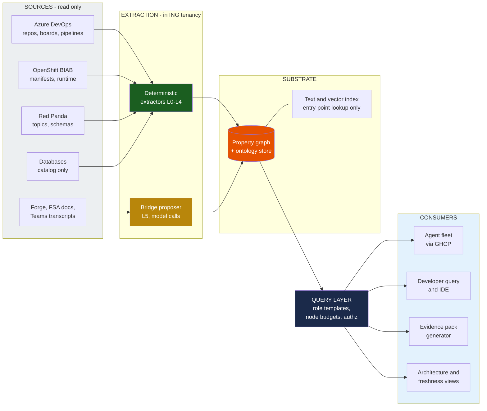
*Diagram T11 — deployment shape. Source systems are **read-only**; the substrate is a
derived asset and never a system of record.*

### 10.1 Deliberate technology neutrality

We are not proposing a product. The design requires five capabilities, and several stacks
provide them:

| Requirement | Why | Satisfied by |
|---|---|---|
| Typed property graph with multi-hop traversal | Blast radius, traceability | Neo4j, Memgraph, Amazon Neptune, Apache AGE on Postgres, TigerGraph |
| Constraint/ontology validation | §7 guardrails | SHACL, OWL reasoner, or application-layer rules |
| Incremental write with node identity | Curation | Any of the above |
| Runs inside ING's approved estate | Non-negotiable | Deployment model to be confirmed `[ASSUMPTION — validate with client]` |
| Text/vector index for entry-point lookup | Natural-language entry only | Any; **retrieval is graph-first, not vector-first** |

> **On Neo4j specifically:** Emil Eifrem's semantic-layer argument is cited in this pitch as
> practitioner evidence, and it is **vendor-interested** `T2`. The architecture does not depend
> on his product. If ING's approved estate favours Postgres with Apache AGE, the design is
> unchanged. Saying this before being asked is worth more than any benchmark.

### 10.2 Indicative sizing

Order-of-magnitude, for a payments stream of the scale implied by the current programme.
Sahaj reported 10,000+ classes and 400+ tables on a comparable single-estate exercise `T2`.

| Node class | Indicative count | Basis |
|---|---|---|
| Class / Method | 10⁴ – 10⁶ | Comparable to Sahaj's reported estate |
| Table / Column | 10³ – 10⁴ | 400+ tables reported on a comparable exercise |
| Endpoint / Topic | 10² – 10³ | 80+ REST, 60+ SOAP on a comparable exercise |
| WorkItem / PR / Commit | 10⁵ – 10⁶ | Full programme history |
| Business ontology nodes | 10³ | BIAN + ISO 20022 + FIBO subset |
| Bridge edges | 10³ – 10⁴ | The curated layer — deliberately the smallest and most valuable |

**This is a small graph by graph-database standards.** Performance is not the risk. **Curation
is the risk**, which is why §8 exists and why the bridge layer is deliberately the smallest
part of the model.

---

## 11. Known blind spots

Stated plainly, because an architect who finds these unaided will discount everything else.

| Blind spot | Why the extraction misses it | Mitigation |
|---|---|---|
| **Reflection and dynamic dispatch** | No static analyser resolves runtime type resolution | Supplement with distributed traces from running environments — runtime truth beats static inference |
| **String-driven behaviour** | Routing keyed on config or database values is invisible to the AST | Config extraction + trace correlation; flag as a known-incomplete region |
| **Stored procedures and database logic** | Business rules living in PL/SQL are outside the JVM analysers | Separate extractor; declare coverage explicitly rather than implying completeness |
| **Vendor and closed-source components** | No source to parse | Model at the contract boundary only; mark the interior opaque |
| **Batch and scheduler logic** | Often outside repositories entirely | Requires client input `[ASSUMPTION — validate with client]` |
| **Tacit rationale — *why* it was built this way** | Not in any artefact; it is in people | Partially recoverable from FSA documents, ADO discussions and Teams transcripts, always at `confidence < 1.0` |

> **The graph must record its own ignorance.** A region marked *"not extracted — reflection
> heavy"* is a useful, trustworthy artefact. A region silently omitted is a lie that will
> eventually be discovered, and it would discredit everything else in the model.

---

## Appendix — Diagram index

All diagrams in `diagrams/tech/`, as `.mmd` source + `.png` + `.svg`, render-verified.

| ID | Diagram | Use on |
|---|---|---|
| T1 | Why a graph, not a doc set or vector store | Technical annex opener; rebuttal to "why not just RAG?" |
| T2 | The three-layer stack | **Primary architecture slide** |
| T3a | Metamodel — business-to-technical core | Technical annex; hand out as a reference |
| T3b | Metamodel — delivery and assurance chain | Traceability discussion; audit conversation |
| T4 | Confidence split — deterministic vs inferred | **The compliance answer** |
| T5 | The build pipeline, L0–L6 | Shows six of seven layers use no model |
| T6 | Worked example — Verification of Payee | **The slide that converts sceptics** |
| T7 | Retrieval contract — task to context pack | Answers "how does the agent actually use it?" |
| T8 | Role-to-query contract | Shows Verify's independence is enforced, not promised |
| T9 | Ontology as validator | The neuro-symbolic guardrail |
| T10 | Curation loop | **Answers the strongest objection** |
| T11 | Deployment shape | For the infrastructure and security reviewers |

### If you only present four of these

**T2** (what we are building) · **T6** (what it answers) · **T4** (why it is auditable) ·
**T10** (why it will not rot).

Those four, in that order, are a complete technical argument in under ten minutes.
