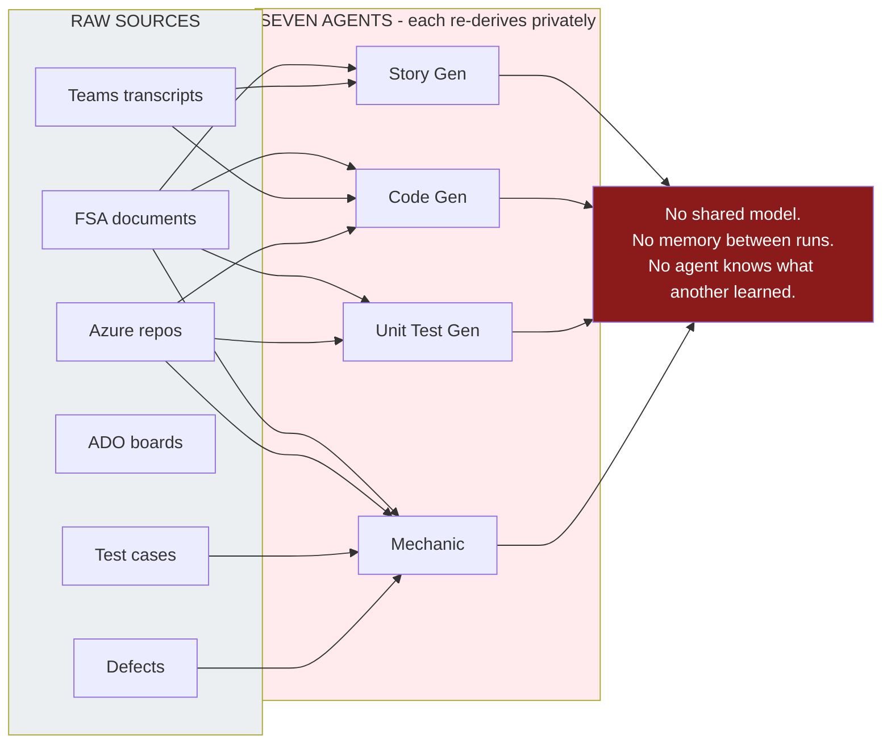
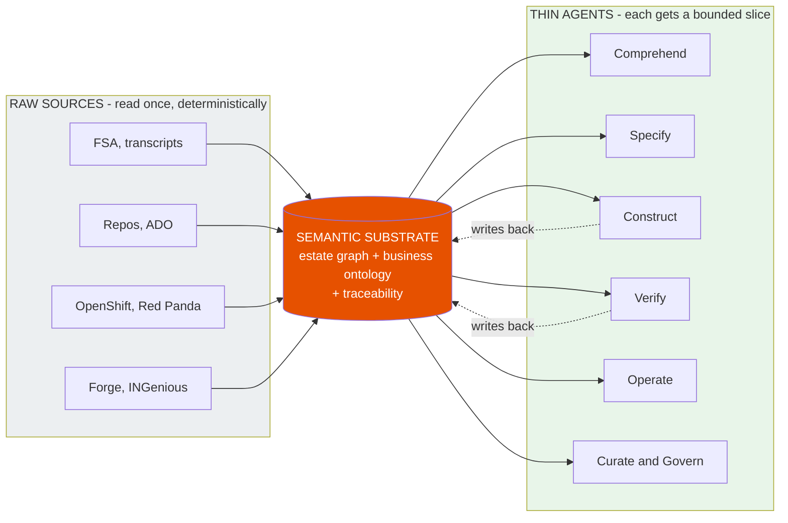
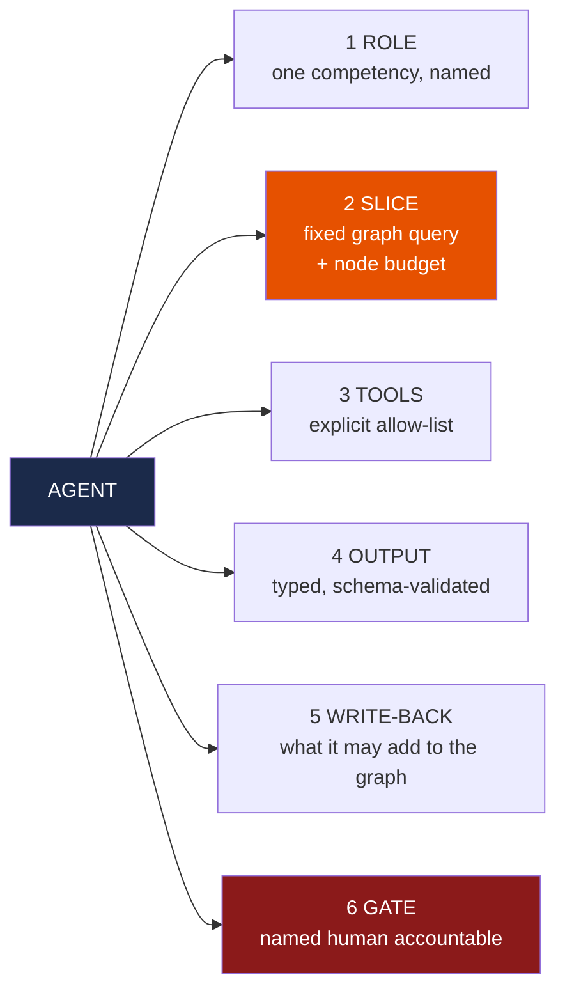
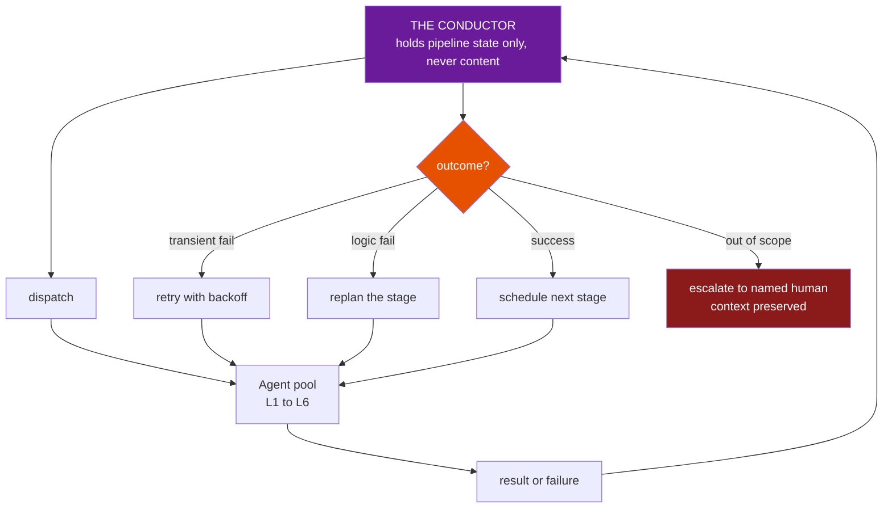
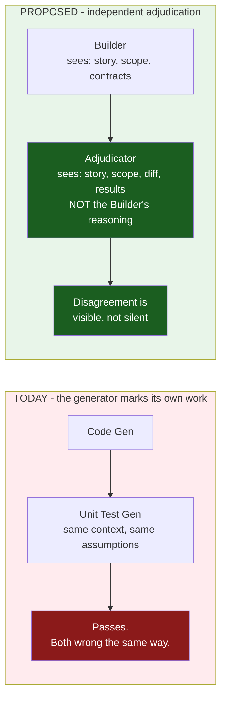
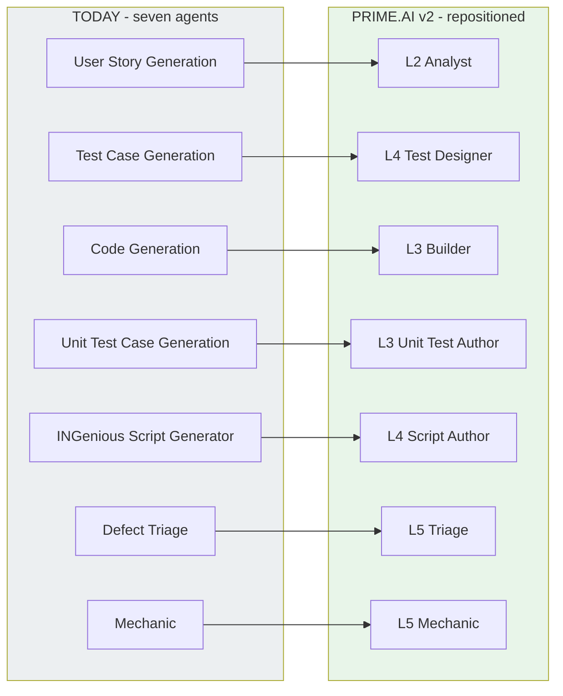
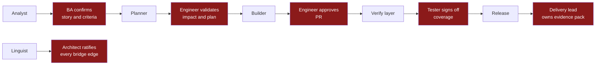
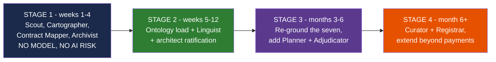

# The Agent Fleet — Layer by Layer
### From seven generators to a governed fleet on a semantic substrate
#### ING Core Banking / BTA Payments · PRIME.AI v2

**Read this if you are:** a tech lead who wants to know exactly what each agent does, reads and
writes — or a business stakeholder who wants to know what changes, what survives, and why it is
safer than what we have today.

**The one-line story:**
> **All seven agents you have today survive. We build the floor underneath them, and we add
> the checks around them.**

**Companion documents:** [`03-slide-deck-content.md`](03-slide-deck-content.md) (the pitch) ·
[`04-research-paper.md`](04-research-paper.md) (the evidence) ·
[`05-knowledge-graph-technical-deep-dive.md`](05-knowledge-graph-technical-deep-dive.md) (the graph)

**Diagrams:** `diagrams/fleet/` — `.mmd` + `.png` + `.svg`, all render-verified.

---

## Contents

| § | Section | Diagram |
|---|---|---|
| 1 | What we run today, and the one structural flaw | F1 |
| 2 | The reframe — one substrate, many thin agents | F2 |
| 3 | **The fleet, layer by layer** | **F3** |
| 4 | The contract every agent obeys | F4 |
| 5 | Agent cards — all 16, Sahaj-style | — |
| 6 | The Conductor | F5 |
| 7 | **End to end: one payment feature through the fleet** | **F6** |
| 8 | Why Verify must not report to Construct | F7 |
| 9 | Migration — where each of today's seven agents lands | F8 |
| 10 | Human gates | F9 |
| 11 | Build order | F10 |

---

## 1. What we run today

Seven agents, live on the BTA Payments stream, on GitHub Copilot custom agents + Claude.

| # | Agent today | What it does | What it reads |
|---|---|---|---|
| 1 | **User Story Generation** | Requirements → user stories with acceptance criteria | FSA + Teams transcript |
| 2 | **Test Case Generation** | Stories → functional and regression test cases | FSA + transcript + stories |
| 3 | **Code Generation** | Designs and specs → production code | FSA + stories + dependent repos + transcript + query log + mapping doc |
| 4 | **Unit Test Case Generation** | Creates and validates unit tests | FSA + stories + repo |
| 5 | **INGenious Test Script Generator** | FSA + test cases → automation scripts | FSA + test cases |
| 6 | **Defect Triage** | Test results → classified, routed defects | test cases + defects |
| 7 | **Mechanic** | Flags automation gaps, recommends fixes | FSA + repo + test cases + defects + stories |

**This is real, it is working, and it is more than most banks have.** The four-file
configuration model (`instructions.md` / `skills.md` / `agents.md` / `prompts.md`) matches where
the industry has landed. None of that is in question.

### 1.1 The one structural flaw

Look at the "what it reads" column. **Every agent independently re-derives its understanding of
the payments estate from raw sources, in private, every time it runs — and throws it away.**

*Diagram F1 — today. Seven agents, seven source systems, every connection point a private
re-derivation. Nothing accumulates.*

**Three consequences, all of which are felt today:**

| Symptom | Root cause |
|---|---|
| Agents give inconsistent answers about the same system | No shared model — each derives its own |
| Quality degrades as the estate grows | Context cost scales with the estate, not the task |
| Nothing improves run to run | Understanding is discarded after every invocation |

> The current deck calls the knowledge graph an **outcome** and a **"cached KG."** That is the
> single change that matters. **A cache is what you keep after the work. A substrate is what you
> stand on before you start.** Same words, opposite architecture.

---

## 2. The reframe

*Diagram F2 — tomorrow. One derivation, shared. Every agent thinner, every agent better
grounded, and the substrate improves with every change that flows through it.*

| | Today | With the substrate |
|---|---|---|
| Integrations | 7 agents × 7 sources | 7 sources → 1 substrate → N agents |
| Adding an 8th agent | 7 new integrations | 1 query template |
| Agent context size | Grows with the estate | Bounded by the task |
| Consistency between agents | Not guaranteed | Guaranteed — same source of truth |
| Learning between runs | None | Every accepted change enriches the graph |

---

## 3. The fleet, layer by layer

**16 agents. 6 layers. 1 Conductor.** Seven are the agents you run today, repositioned and
re-grounded. Nine are new — and note *what* is new: comprehension, independent verification,
curation and governance. **Not more generators.**

```mermaid
flowchart LR
    L0["L0 GROUND TRUTH<br/>no agents, only tools<br/>build files, LSP, OpenAPI,<br/>DB catalog, Git, ADO"]
    L1["L1 COMPREHEND<br/>5 agents<br/>Scout, Cartographer,<br/>Contract Mapper,<br/>Archivist, Linguist"]
    KG[("SEMANTIC<br/>SUBSTRATE<br/>estate graph<br/>+ ontology<br/>+ traceability")]
    L2["L2 SPECIFY<br/>2 agents<br/>Analyst, Planner<br/>impact known<br/>before build"]
    L3["L3 CONSTRUCT<br/>2 agents<br/>Builder,<br/>Unit Test Author"]
    L4["L4 VERIFY<br/>3 agents<br/>Test Designer, Script<br/>Author, Adjudicator<br/>INDEPENDENT"]
    L5["L5 OPERATE<br/>2 agents<br/>Triage, Mechanic"]
    L6["L6 CURATE and GOVERN<br/>2 agents<br/>Curator keeps it true<br/>Registrar proves it"]

    L0 --> L1
    L1 --> KG
    KG --> L2
    L2 --> L3
    L3 --> L4
    L4 --> L5
    L5 --> L6
    L6 -.->|"every change enriches the substrate"| KG

    style L0 fill:#1B2A4A,color:#ffffff
    style L1 fill:#2E5E8B,color:#ffffff
    style KG fill:#E65100,color:#ffffff
    style L2 fill:#2E7D32,color:#ffffff
    style L3 fill:#5B3A8E,color:#ffffff
    style L4 fill:#8B1A1A,color:#ffffff
    style L5 fill:#00695C,color:#ffffff
    style L6 fill:#6A1B9A,color:#ffffff
```

*Diagram F3 — **the fleet.** Read left to right: tools produce ground truth, five comprehension
agents turn it into the substrate, and every agent downstream stands on it. **The dotted return
edge is the point** — every change that ships enriches the substrate, so the next feature starts
better informed than the last. It is a loop, not a pipeline.*

### 3.1 The layer summary — one table for the whole fleet

| Layer | Agents | Reads | Code access | Uses a model? | Human gate |
|---|---|---|---|---|---|
| **L0 Ground truth** | *none — tools only* | Build files, LSP, contracts, catalogs, Git, ADO | Parsers only | ❌ Never | — |
| **L1 Comprehend** | Scout, Cartographer, Contract Mapper, Archivist, **Linguist** | Tool output and the graph | **Never** (Linguist: candidate lists only) | Only **Linguist** | Ratify bridge edges |
| **L2 Specify** | Analyst, **Planner** | Graph slice + FSA + transcript | Surgical reads only | ✅ | ✅ BA confirms |
| **L3 Construct** | Builder, Unit Test Author | Graph slice + target files + conventions | Surgical, scoped | ✅ | ✅ Engineer approves |
| **L4 Verify** | Test Designer, Script Author, **Adjudicator** | Graph slice + acceptance criteria + result | **Not the Builder's rationale** | ✅ | ✅ Tester approves |
| **L5 Operate** | Triage, Mechanic | Graph slice + defects + logs + traces | Surgical reads | ✅ | ✅ Owner accepts routing |
| **L6 Govern** | **Curator**, **Registrar** | The graph and its change log | None | ❌ | ✅ Curator resolves conflicts |

> **Read the "Uses a model?" column aloud in the room.** Of six layers, two use no model at all
> and one uses it for a single bounded task. That ratio *is* the risk answer.

---

## 4. The contract every agent obeys

No agent is free-form. Every one of the sixteen is declared against the same six-part contract,
and the platform — not the prompt — enforces it.

*Diagram F4 — the agent contract. **Clause 2 is the important one:** an agent cannot widen its
own context. That is what makes behaviour reproducible and cost predictable.*

**Why this matters commercially:** an agent that cannot widen its own context has a
**predictable token cost per invocation**. Cost per accepted story becomes a forecastable
number rather than a monthly surprise.

---

## 5. Agent cards

Format follows the Sahaj convention — Mission / Reads / Tools / Produces / Reads code? — with
two additions the bank will ask for: **writes to graph** and **human gate**.

---

### LAYER 1 — COMPREHEND
> *Builds and maintains the substrate. Five agents. Four of them never invoke a model.*

#### 🔍 Scout
| | |
|---|---|
| **Mission** | Establish the skeleton of the payments estate before anyone reads a line of code |
| **Reads** | Build files only — `pom.xml`, `build.gradle`, `package.json`, Helm charts |
| **Tools** | Build tool introspection, glob, OpenShift manifest reader |
| **Writes to graph** | `Repository`, `Module`, `Service`, `CONTAINS` |
| **Reads code?** | **Never** |
| **Model?** | ❌ |
| **Human gate** | None — deterministic, `confidence 1.0` |
| **Status** | 🆕 New |

#### 🗺️ Cartographer
| | |
|---|---|
| **Mission** | Resolve every symbol and every static relationship in the estate |
| **Reads** | Scout's graph output |
| **Tools** | LSP servers, tree-sitter, dependency analysers |
| **Writes to graph** | `Class`, `Method`, `CALLS`, `DEPENDS_ON`, `IMPORTS` |
| **Reads code?** | **Never** — tool output only |
| **Model?** | ❌ |
| **Human gate** | None |
| **Status** | 🆕 New |

#### 🔌 Contract Mapper
| | |
|---|---|
| **Mission** | Map every boundary the estate exposes or consumes |
| **Reads** | Cartographer's graph output |
| **Tools** | OpenAPI/WSDL parsers, Avro schema registry, Red Panda metadata, DB `information_schema` |
| **Writes to graph** | `Endpoint`, `Topic`, `Table`, `Column`, `EXPOSES`, `PRODUCES`, `CONSUMES`, `WRITES` |
| **Reads code?** | **Never** |
| **Model?** | ❌ |
| **Human gate** | None |
| **Status** | 🆕 New |

#### 📚 Archivist
| | |
|---|---|
| **Mission** | Connect the code to the delivery record, so traceability is a fact and not a reconstruction |
| **Reads** | Graph + Azure DevOps + Git |
| **Tools** | ADO REST API, Git history, pipeline API, INGenious results |
| **Writes to graph** | `WorkItem`, `PullRequest`, `Commit`, `Release`, `Test`, `Defect`, `Approval` + edges |
| **Reads code?** | **Never** |
| **Model?** | ❌ |
| **Human gate** | None |
| **Status** | 🆕 New |

#### 🌐 Linguist  *— the only L1 agent that uses a model*
| | |
|---|---|
| **Mission** | Join the business ontology to the technical estate — *"which code implements Verification of Payee?"* |
| **Reads** | Graph + BIAN v12 + ISO 20022 + FSA documents + Teams transcripts. **Never the raw repository.** |
| **Tools** | Deterministic candidate generation, then bounded LLM adjudication |
| **Writes to graph** | `IMPLEMENTS`, `CARRIES`, `REALISED_AS`, `GOVERNED_BY` — **always `confidence < 1.0`** |
| **Reads code?** | Candidate identifier lists only — it can never invent a name that does not exist |
| **Model?** | ✅ |
| **Human gate** | ✅ **Architect ratifies every bridge edge before it reaches `confidence 1.0`** |
| **Status** | 🆕 New — **this is the highest-value agent in the fleet** |

---

### LAYER 2 — SPECIFY
> *Turns intent into buildable work. Impact is known before a line is written.*

#### 📝 Analyst  *(replaces User Story Generation)*
| | |
|---|---|
| **Mission** | FSA + meeting intent → EPIC-wise user stories with acceptance criteria and *real* traceability links |
| **Reads** | Graph slice: business terms, the regulation, similar past work items, existing implementations — **plus** FSA and transcript |
| **Tools** | Orange Sharing, SharePoint, ADO write |
| **Writes to graph** | `WorkItem` + `TRACES_TO` edges to `BusinessProcess` and `Regulation` |
| **Reads code?** | No |
| **Model?** | ✅ |
| **Human gate** | ✅ BA confirms, then push to ADO |
| **What changed** | Today it reads two documents. Now it also knows **what already exists**, so it stops writing stories for things already built, and every story is linked to the regulation that demands it |
| **Status** | ♻️ Today's agent, re-grounded |

#### 🧭 Planner
| | |
|---|---|
| **Mission** | Before any code: what does this story touch, what will it break, what must be regression-tested? |
| **Reads** | Graph slice: blast radius traversal, contracts, consumers, coverage gaps |
| **Tools** | Graph traversal — **largely deterministic** |
| **Writes to graph** | `IMPACT_SCOPE` on the work item — the declared blast radius |
| **Reads code?** | Surgical reads only |
| **Model?** | ✅ (narrative only; the impact set itself is a query result) |
| **Human gate** | ✅ Engineer validates the plan — *this is the existing `*` checkpoint, now with evidence behind it* |
| **Status** | 🆕 New |

> **Planner is the agent that pays for the graph.** *"What breaks if I change this?"* is the
> question that costs a senior payments engineer days, and it is a graph traversal. It also
> produces the declared scope the Adjudicator later checks the change against.

---

### LAYER 3 — CONSTRUCT
> *Writes the change. Deliberately the narrowest context in the fleet.*

#### 🔨 Builder  *(replaces Code Generation)*
| | |
|---|---|
| **Mission** | Implement the approved story within the declared impact scope |
| **Reads** | Graph slice: target class, direct callers, contracts it must honour, Forge coding standards, existing patterns, related tests |
| **Tools** | Azure Repos, Forge CLI, build and lint |
| **Writes to graph** | `PullRequest`, `TOUCHES` edges |
| **Reads code?** | Surgical, scoped to the impact set |
| **Model?** | ✅ |
| **Human gate** | ✅ Engineer approves before PR |
| **What changed** | Today it reads six input sources and rebuilds understanding each run. Now it gets a bounded slice — and it *knows the contracts it must not break*, because they are edges |
| **Status** | ♻️ Today's agent, re-grounded |

#### 🧪 Unit Test Author  *(replaces Unit Test Case Generation)*
| | |
|---|---|
| **Mission** | Generate and validate unit tests for the change |
| **Reads** | Graph slice: the change, its callers, existing coverage, test conventions |
| **Tools** | `mvn clean test`, coverage tooling |
| **Writes to graph** | `Test`, `COVERS` edges |
| **Reads code?** | Surgical |
| **Model?** | ✅ |
| **Human gate** | ✅ PR raised post-verification |
| **What changed** | Today it uses a **"cached KG"**. Now it queries the live substrate and can see *which callers have no coverage* — turning coverage from a percentage into a targeted list |
| **Status** | ♻️ Today's agent, re-grounded |

---

### LAYER 4 — VERIFY
> *Independent of Construct by design. Three agents. **This layer is the control.***

#### 🎯 Test Designer  *(replaces Test Case Generation)*
| | |
|---|---|
| **Mission** | Stories → functional and regression test cases, targeted by actual risk |
| **Reads** | Graph slice: acceptance criteria, the impact set, historical defect clusters on the touched services, uncovered paths |
| **Tools** | ADO test plans |
| **Writes to graph** | `Test`, `VERIFIES` edges to `BusinessProcess` |
| **Reads code?** | No |
| **Model?** | ✅ |
| **Human gate** | ✅ Tester verifies, push to task board |
| **What changed** | Regression scope stops being *"everything, to be safe"* and becomes *"the 40 tests that touch this blast radius, plus the 6 where defects historically cluster"* |
| **Status** | ♻️ Today's agent, re-grounded |

#### ⚙️ Script Author  *(replaces INGenious Test Script Generator)*
| | |
|---|---|
| **Mission** | Test cases → INGenious automation scripts with reusable assertion components |
| **Reads** | Graph slice: test cases, endpoint contracts, existing reusable components |
| **Tools** | INGenious framework, Azure Repos |
| **Writes to graph** | `Test` automation status, `COVERS` |
| **Reads code?** | Surgical |
| **Model?** | ✅ |
| **Human gate** | ✅ PR post-verification |
| **What changed** | It can see which reusable components already exist, so it stops re-creating them |
| **Status** | ♻️ Today's agent, re-grounded |

#### ⚖️ Adjudicator
| | |
|---|---|
| **Mission** | Independently answer one question: *does this change do what the story asked, and only that?* |
| **Reads** | Acceptance criteria · the declared impact scope · the actual diff · ontology constraints · test results. **Explicitly NOT the Builder's reasoning or plan.** |
| **Tools** | Ontology/SHACL validation, coverage analysis, graph diff |
| **Writes to graph** | `Adjudication` verdict with reasons, linked to the PR |
| **Reads code?** | The diff only |
| **Model?** | ✅ |
| **Human gate** | ✅ Escalates to a named human on failure, context preserved |
| **Status** | 🆕 New — **the agent a regulator will care about most** |

**Four checks the Adjudicator runs before a human is asked to spend attention:**

| Check | Fails when |
|---|---|
| **Scope** | The change touched something outside the Planner's declared impact set |
| **Intent** | An acceptance criterion has no corresponding test |
| **Constraint** | The change violates an ontology rule (§7 of the deep dive) |
| **Evidence** | A regulatory obligation is left with no `VERIFIES` edge |

---

### LAYER 5 — OPERATE
> *Both of today's operational agents survive with their names intact.*

#### 🚨 Triage  *(today's Defect Triage)*
| | |
|---|---|
| **Mission** | Classify defects, identify root cause, route to the right owner, produce the daily triage report |
| **Reads** | Graph slice: the defect, the release that shipped it, the work items in that release, recent changes on the failing path, similar historical defects |
| **Tools** | ADO, Azure CLI pipeline logs, OpenShift CLI, Red Panda CLI |
| **Writes to graph** | `Defect` classification, `ROOT_CAUSE` edges |
| **Reads code?** | Surgical |
| **Model?** | ✅ |
| **Human gate** | ✅ Owner accepts routing |
| **What changed** | *"Route to the right owner"* becomes a graph lookup — `Defect → Release → PR → Service → owner` — rather than a guess from the stack trace |
| **Status** | ♻️ Today's agent, re-grounded |

#### 🔧 Mechanic  *(name retained)*
| | |
|---|---|
| **Mission** | Find automation gaps and specification drift; recommend and prepare fixes |
| **Reads** | Graph slice: coverage gaps ranked by blast radius, regulatory obligations with no test edge, contract drift |
| **Tools** | Automated scans, INGenious, ADO |
| **Writes to graph** | `Gap` findings with severity |
| **Reads code?** | Surgical |
| **Model?** | ✅ |
| **Human gate** | ✅ Recommendation, not action |
| **What changed** | Today it scans for gaps. Now it **ranks them by what they would break** — and can flag the specific case that matters here: *a regulatory obligation with no test proving it* |
| **Status** | ♻️ Today's agent, re-grounded |

---

### LAYER 6 — CURATE & GOVERN
> *The two agents that make the difference between a living system and a stale map.*

#### 🧹 Curator
| | |
|---|---|
| **Mission** | Keep the substrate true. Detect drift, quarantine contradictions, publish freshness |
| **Reads** | Estate change events, the graph, its own change log |
| **Tools** | Fingerprint diffing, incremental re-extraction, contradiction detection |
| **Writes to graph** | `lastVerifiedAt` refresh, quarantine flags, freshness metrics |
| **Reads code?** | No |
| **Model?** | ❌ |
| **Human gate** | ✅ Human resolves flagged contradictions |
| **Status** | 🆕 New — **without this, everything above decays into a stale wiki** |

#### 🏛️ Registrar
| | |
|---|---|
| **Mission** | Every agent action attributable; every release provable |
| **Reads** | The action log and the traceability graph |
| **Tools** | Identity provider, immutable log, evidence pack generator |
| **Writes to graph** | `AgentAction`, `Approval`, evidence pack manifests |
| **Reads code?** | No |
| **Model?** | ❌ |
| **Human gate** | — it *is* the gate record |
| **Status** | 🆕 New |

> **The Registrar's output is the answer to the question that decides this engagement:**
> *"Show me who changed this, on whose authority, against which requirement, with what test
> evidence."* Today that is a person and a spreadsheet. It becomes a query.

---

## 6. The Conductor

Adopted from Sahaj's pattern, because it is correct: **hub and spoke, state in, instructions
out.** The Conductor holds **pipeline state only — never content** — so it cannot be
contaminated by the material it coordinates.

*Diagram F5 — the Conductor. **Failure is a designed state, not an exception.** Retry, replan,
or escalate to a named human — never fail silently, never guess onward.*

It answers the three questions the current architecture does not:

| Question | Answer |
|---|---|
| How many agents run, and when? | The Conductor decides from pipeline state and node budgets |
| What happens when a stage fails? | Retry → replan → escalate, in that order |
| What runs in parallel, what must wait? | Declared dependencies between stages |

---

## 7. End to end — one payment feature through the fleet

**This is the slide that tells the story.** One requirement — *Verification of Payee* — from
regulation to evidence pack.

```mermaid
flowchart LR
    R["REGULATION<br/>Verification of Payee<br/>is mandated"]
    R --> AN["ANALYST<br/>story + acceptance criteria<br/>linked to the regulation"]
    AN --> G1{"BA<br/>confirms"}
    G1 --> PL["PLANNER<br/>blast radius: 2 services,<br/>1 contract, 14 tests"]
    PL --> G2{"Engineer<br/>validates plan"}
    G2 --> BU["BUILDER<br/>implements inside<br/>declared scope"]
    BU --> UT["UNIT TEST AUTHOR<br/>covers new paths<br/>and uncovered callers"]
    UT --> AD["ADJUDICATOR<br/>scope, intent,<br/>constraint, evidence"]
    AD --> G3{"Engineer<br/>approves PR"}
    G3 --> TD["TEST DESIGNER<br/>+ SCRIPT AUTHOR<br/>risk-targeted regression"]
    TD --> REL["RELEASE"]
    REL --> RG["REGISTRAR<br/>evidence pack<br/>generated, not assembled"]
    REL --> CU["CURATOR<br/>substrate updated"]

    style R fill:#1B2A4A,color:#ffffff
    style AD fill:#8B1A1A,color:#ffffff
    style RG fill:#6A1B9A,color:#ffffff
    style CU fill:#E65100,color:#ffffff
    style G1 fill:#FFF3E0
    style G2 fill:#FFF3E0
    style G3 fill:#FFF3E0
```

*Diagram F6 — **end to end.** Three human gates (cream). One independent adjudication (red).
Evidence generated at the end, not reconstructed at audit time. The Curator closes the loop —
the next feature starts from a substrate that already knows about this one.*

### 7.1 The same journey, told for the business

| Stage | The question being answered | Who is accountable |
|---|---|---|
| Analyst | "What exactly are we building, and which rule requires it?" | Business Analyst |
| Planner | "What will this break?" | Engineer |
| Builder + Unit Test Author | "Build it, and prove the parts work." | Engineer |
| **Adjudicator** | **"Did we build what was asked — and nothing else?"** | **Independent** |
| Test Designer + Script Author | "Prove it works in the flow that matters." | Tester |
| Registrar | "Prove all of the above to an auditor." | Delivery lead |
| Curator | "Make the next feature cheaper than this one." | Platform |

> **The last row is the compounding argument.** Every feature that flows through the fleet
> leaves the substrate richer than it found it. This is the opposite of today, where every run
> starts from zero.

---

## 8. Why Verify must not report to Construct

*Diagram F7 — the independence argument.*

**The failure mode this prevents is specific and real.** If the agent that wrote the code also
writes the test, both inherit the same misreading of the requirement. The test passes. The
defect ships. Nothing in the pipeline registers a problem, because internally the pipeline is
perfectly consistent — and consistently wrong.

An independent checker that has read the author's justification is not independent. **This is
not an AI principle; it is the segregation-of-duties principle the bank already applies to
humans.** We are applying an existing, understood control to a new class of actor — which is
precisely why it will pass a control review.

---

## 9. Migration — where today's seven agents land

**Nothing is discarded.** Every one of the seven survives, keeps its purpose, and gains a
foundation.

*Diagram F8 — one-to-one migration. No agent is retired; no work is wasted.*

**Note what moved layer.** Test Case Generation and the Script Generator move from being
downstream of Code Generation to sitting in an **independent Verify layer**. That is an
organisational change as much as a technical one — and it is the change that converts the fleet
from a production line into a controlled process.

### 9.1 What is genuinely new, and why

| New agent | Why it did not exist before | What it makes possible |
|---|---|---|
| Scout, Cartographer, Contract Mapper, Archivist | Comprehension was never a job — agents re-derived it privately | The substrate itself |
| **Linguist** | Nothing connected business language to code | *"Show me everything implementing SEPA Instant"* |
| **Planner** | Impact was assessed in people's heads | Blast radius known **before** the change |
| **Adjudicator** | The generator marked its own homework | An independent, evidenced control |
| **Curator** | Nothing kept understanding current | A map that stays true |
| **Registrar** | Evidence was assembled by hand at audit time | Evidence packs on demand |

> **Read that "why" column as the gap analysis.** Every new agent exists because a real
> question had no owner — not because more automation seemed desirable.

---

## 10. Human gates

Agents propose. **Humans decide.** Every gate has a named accountable role — and the gates are
the ones the programme already runs, not new bureaucracy.

*Diagram F9 — six gates, six named roles. **No agent commits to a production branch. No agent
approves its own output. No agent writes a `confidence 1.0` fact into the graph.***

**Say this explicitly in the room, because they will not ask it directly:** the ratio of
automation to human judgement does not change. What changes is **what the human is looking at**
— a plan with a real impact set instead of a guess, a diff with an independent verdict attached
instead of a wall of generated code.

---

## 11. Build order

Sequenced so the earliest stage carries **no AI risk at all** and still produces something
useful on its own.

*Diagram F10 — build order.*

| Stage | Ships | Value even if you stop here |
|---|---|---|
| **1** | Four deterministic comprehension agents | A queryable map of the payments estate: dependencies, contracts, coverage gaps, knowledge-concentration risk. **No model involved.** |
| **2** | Ontology + Linguist + ratification | *"Show me everything implementing this regulation"* becomes answerable |
| **3** | Seven existing agents re-grounded, plus Planner and Adjudicator | Better-grounded generation, impact known up front, independent verification |
| **4** | Curator + Registrar | It stays true, and it proves itself to audit |

> **Stage 1 is the whole commercial argument.** Four weeks, no AI risk, no model, and it
> produces an artefact the bank would want even if the rest of the programme were cancelled.
> It is the cheapest possible way for ING to test whether any of this is true.

---

## Appendix — Diagram index

All in `diagrams/fleet/` as `.mmd` + `.png` + `.svg`, render-verified.

| ID | Diagram | Use it to |
|---|---|---|
| F1 | Today — seven agents re-deriving privately | Establish the problem **without criticising the team** |
| F2 | The reframe — one substrate, thin agents | The single-picture summary |
| **F3** | **The fleet, layer by layer** | **The centrepiece architecture slide** |
| F4 | The agent contract | Answer "how do you control them?" |
| F5 | The Conductor | Answer "what happens when it fails?" |
| **F6** | **End to end, one payment feature** | **The story slide — walk the room through it** |
| F7 | Verify independence | The control-review answer |
| F8 | Migration map | Reassure: nothing is discarded |
| F9 | Human gates | The accountability answer |
| F10 | Build order | Close on stage 1 |

### The four-slide version

**F1** (here is the flaw) → **F3** (here is the fleet) → **F6** (here is a feature flowing
through it) → **F10** (here is the four-week, no-AI-risk first step).

That is a complete narrative arc: problem → architecture → proof → ask.
